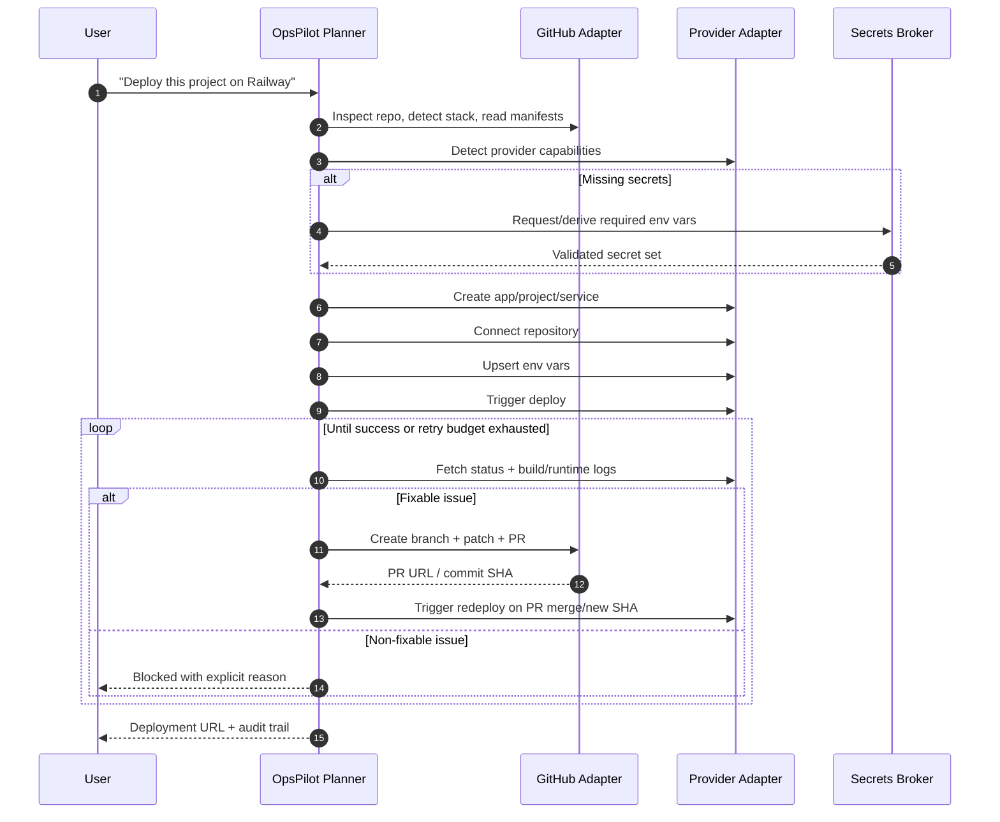
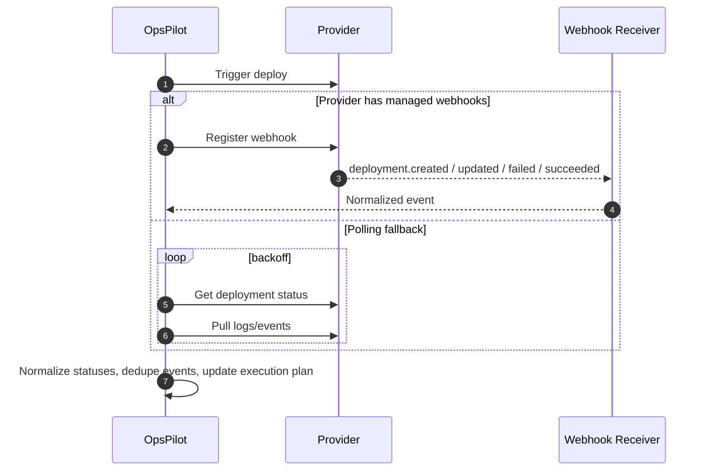

# OpsPilot Feasibility on Vercel and Railway

## Executive summary

OpsPilot **can plausibly accept a vague prompt such as “deploy this project on Railway” and complete a large part of the job**, but only if the product is designed as a **multi-adapter deployment orchestrator** rather than “an LLM calling one provider API”. The orchestration layer must combine **GitHub access for code changes and pull requests**, **provider adapters for Vercel and Railway**, **a secrets intake and validation flow**, and **a guarded debug loop** that reads provider logs, proposes fixes, opens PRs, and redeploys with explicit policy boundaries. The core provider primitives do exist: Vercel exposes REST APIs for project creation, environment variables, deployments, deployment events, runtime logs, repository discovery, and webhooks; Railway exposes a public GraphQL API for project/service creation, variable management, deployments, build/runtime/HTTP logs, environment management, and rollback/redeploy actions. citeturn13view8turn13view1turn13view2turn13view6turn13view5turn13view7turn25search0turn27view0turn29search1turn26view0turn39search0

The important qualifier is that **“fully deploy, read logs, debug, edit envs, fix code via PRs, and deliver a working site” is not a pure Vercel/Railway problem**. The “fix code via PRs” part belongs to GitHub, not the hosting providers. The “fill missing env vars correctly” part depends on secret collection and application-specific validation. The “pick the right provider from a vague prompt” part depends on capability detection. And the “deliver a working site” part can be blocked by runtime model mismatches: for example, Vercel is fundamentally a serverless / functions-oriented platform where functions scale to zero and there is not “a server always running in the background”, while Railway is better suited to persistent services and container-style backends. citeturn21view1turn21view2turn25search2

My bottom line is:

- **Yes, for a constrained MVP**: GitHub-connected repos, Vercel for frontend / compatible serverless backends, Railway for persistent backend services, guided secrets entry, PR-based fixes, and human-visible audit trails. citeturn23view5turn23view0turn27view0turn29search1
- **Not yet as “one vague prompt and zero guardrails for any project on any platform”**: provider differences, secrets ambiguity, provider-specific build/runtime limits, rollback semantics, webhook gaps, undocumented or incomplete edge capabilities, and LLM debugging risk make fully autonomous general deployment unreliable without staged guardrails. citeturn21view3turn21view4turn21view5turn29search1turn39search0turn30search2

The most practical product shape is to make **OpsPilot opinionated**: detect the repo shape, propose a plan, collect missing secrets, choose the provider intentionally, apply changes through PRs, then run a bounded deploy-debug loop. That is realistic. A fully unbounded “deploy anywhere, fix anything, no questions asked” agent is not. citeturn21view1turn25search2turn30search2turn36view0

## Verified provider capabilities from official docs

### Vercel

Vercel’s public API is a **REST API at `https://api.vercel.com`**, authenticated primarily with **Vercel Access Tokens** sent as bearer tokens. The REST API reference explicitly says access tokens are required, and team resources are addressed via `teamId` or `slug` query parameters. Vercel also documents **Sign in with Vercel**, an OAuth 2.0 / OpenID Connect flow for user sign-in, and separate **integration authentication** patterns with user and system OIDC tokens for marketplace-style integrations. citeturn15search2turn14search1turn13view10turn21view7

The key deployment-building endpoints verified in the docs are:

| Capability | Verified endpoint / mechanism | Notes |
|---|---|---|
| Create project | `POST /v11/projects` | Project name required; additional configuration supported. citeturn13view1 |
| Find project | `GET /v9/projects/{idOrName}` | Useful for reconciliation and idempotency. citeturn11search7 |
| List projects | `GET /v10/projects` | Paginated list of authenticated user/team projects. citeturn11search11 |
| Create env vars | `POST /v10/projects/{idOrName}/env` | Supports `upsert=true`; accepts key/value/type/target. citeturn13view2 |
| Edit env var | `PATCH /v9/projects/{idOrName}/env/{id}` | Targeted env update. citeturn13view3 |
| List env vars | `GET /v10/projects/{idOrName}/env` | Project env discovery. citeturn13view4 |
| Create deployment | `POST /v13/deployments` | Supports git deployments or file uploads; can redeploy prior deployment id. citeturn13view0 |
| Upload deployment files | `POST /v2/files` | Needed for non-git API deployments. citeturn12search4 |
| Get deployment | `GET /v13/deployments/{idOrUrl}` | Returns deployment info including ready state and project settings. citeturn22view0 |
| List deployments | `GET /v7/deployments` | Supports filters including project, target, time, state, branch, sha. citeturn22view1 |
| Cancel deployment | `PATCH` cancel endpoint | Verified in deployments API navigation. citeturn12search1turn22view0 |
| Build logs / events | `GET /v3/deployments/{idOrUrl}/events` | Build log / event stream or JSON depending on parameters. citeturn13view6turn17search7 |
| Runtime logs | `GET /v1/projects/{projectId}/deployments/{deploymentId}/runtime-logs` | Streaming runtime logs for a deployment. citeturn13view5turn32view0 |
| Webhooks | `POST /v1/webhooks` | Team or project scoped webhook config. citeturn13view7turn16view0 |
| Repo discovery | `GET /v1/integrations/search-repo` | Lists repositories linked to a namespace/provider; supports GitHub/GitLab/Bitbucket. citeturn13view13turn34search4 |

The Vercel SDK examples also confirm two highly relevant flows for OpsPilot. First, a project can be created with a linked GitHub repository by including a `gitRepository` object with the repo and provider type. Second, a deployment can be created directly from Git metadata using `gitSource` with provider, repo, org, and ref. Those examples materially reduce uncertainty around “repo-connected deploys from API”. citeturn23view0turn24view0

```bash
# Example: create a Vercel project
curl -X POST "https://api.vercel.com/v11/projects?teamId=$VERCEL_TEAM_ID" \
  -H "Authorization: Bearer $VERCEL_TOKEN" \
  -H "Content-Type: application/json" \
  -d '{
    "name": "my-app",
    "framework": "nextjs",
    "gitRepository": {
      "type": "github",
      "repo": "org-or-user/repo"
    }
  }'
```

This example is aligned with the documented project creation endpoint and the SDK example showing `gitRepository` for GitHub-backed projects. citeturn13view1turn23view0

```bash
# Example: create or upsert project environment variables
curl -X POST "https://api.vercel.com/v10/projects/my-app/env?upsert=true&teamId=$VERCEL_TEAM_ID" \
  -H "Authorization: Bearer $VERCEL_TOKEN" \
  -H "Content-Type: application/json" \
  -d '[
    {
      "key": "DATABASE_URL",
      "value": "postgres://...",
      "type": "encrypted",
      "target": ["production","preview"]
    }
  ]'
```

This follows the documented env endpoint, which supports batch creation and `upsert=true`. The SDK example also shows `type` and `target` usage. citeturn13view2turn23view4

```bash
# Example: stream runtime logs for a Vercel deployment
curl -X GET "https://api.vercel.com/v1/projects/$PROJECT_ID/deployments/$DEPLOYMENT_ID/runtime-logs?teamId=$VERCEL_TEAM_ID" \
  -H "Authorization: Bearer $VERCEL_TOKEN"
```

This matches the documented runtime log endpoint for a deployment. citeturn13view5turn32view0

Vercel webhooks are also serviceable for an orchestrator. Vercel documents webhook categories covering deployment events, project events, feature flags, and firewall events. Deployment events include created, succeeded, promoted, rollback, error, and cancelled. The webhook payload is signed, and the docs instruct users to verify the `x-vercel-signature` header with the webhook secret shown once at creation time. citeturn21view6turn16view5

For rate limits, Vercel is better documented than Railway. The REST API docs say rate limits are surfaced via `X-RateLimit-Limit`, `X-RateLimit-Remaining`, and `X-RateLimit-Reset`, and the Limits page gives concrete platform limits such as **100 deployments per day on Hobby** and example duration/scope semantics. citeturn14search1turn21view5

The main product limitation for OpsPilot is architectural, not API completeness. Vercel Functions are serverless and scale to zero, Vercel explicitly says there is no longer “a server always running in the background”, and function bundles and execution duration are bounded. The documented limits include a **45-minute build step maximum**, **250 MB uncompressed bundle size for most functions**, and **up to 30 minutes max duration only for supported Node.js/Python runtimes on Pro/Enterprise with Fluid compute beta**. That means a vague prompt like “deploy the backend on Vercel” is only safe if the backend is Vercel-compatible. citeturn21view1turn21view2turn21view3turn21view4turn20search1

Vercel’s logging model is also bounded. Runtime logs are streamed, each log output can be up to 256 KB, each request can log up to 1 MB total with up to 256 lines per request, and log retention depends on plan, from **1 hour on Hobby** up to **30 days with Observability Plus**. That makes automated debugging possible, but not infinitely forensic. citeturn21view0

### Railway

Railway’s primary public API surface is a **GraphQL endpoint at `https://backboard.railway.com/graphql/v2`**. The API docs explicitly show account tokens, workspace tokens, project tokens, and OAuth-derived access tokens. Account/workspace/OAuth tokens use `Authorization: Bearer`; project tokens are special and use the `Project-Access-Token` header while being restricted to a specific environment within a project. citeturn7search2turn7search4turn38search6

Railway also has an OAuth / OIDC login flow. The docs state that Login with Railway uses **OAuth 2.0 Authorization Code flow with OpenID Connect**, access tokens expire after one hour, refresh tokens are available via `offline_access` plus `prompt=consent`, and claims are retrieved from `/oauth/me`. Workspace and project scopes are selectable by the user and limited to the resources they choose. citeturn8view2turn36view0turn37view5turn38search3

The reviewed Railway capabilities most relevant to OpsPilot are:

| Capability | Verified GraphQL capability / documented behaviour | Notes |
|---|---|---|
| Create project | `projectCreate` | Public API examples are documented. citeturn25search0turn25search3 |
| List/get projects | Query operations in project guide | Supports account/workspace views. citeturn25search0turn38search9 |
| Create service from GitHub | `serviceCreate` with GitHub source | Public docs explicitly document “From a GitHub repository”. citeturn25search1turn27view0 |
| Create service from Docker image | `serviceCreate` with Docker image | Also supports empty service. citeturn27view0turn27view5 |
| Connect/disconnect service repo | Documented in service guide | Important for post-creation repo wiring. citeturn27view0 |
| Update service instance settings | Build/deploy config mutation | Docs say 12 optional fields are available. citeturn27view0turn31search2 |
| Trigger deploy | `serviceInstanceDeployV2` | Can deploy specific `commitSha`; SHA validated against connected repo. citeturn27view0turn28search0 |
| Redeploy | `serviceInstanceRedeploy` | Reuses existing commit/config. citeturn27view0turn28search0 |
| List/get deployments | Deployment management guide | Includes latest active deployment lookup. citeturn29search1turn9view1 |
| Build logs | Deployment log query | Public API explicitly supports build logs. citeturn9view1turn29search1 |
| Runtime logs | `deploymentLogs` query | Supports runtime log retrieval and optional fields. citeturn29search1 |
| HTTP logs | Deployment HTTP log query | Public API support documented. citeturn9view1turn29search1 |
| Restart / rollback / stop / cancel / remove | Deployment actions documented | Rollback only when `canRollback: true`. citeturn9view2turn9view6turn30search2 |
| Variable get/upsert/delete | `variableUpsert`, `variableCollectionUpsert`, delete variable | Shared vars and service vars supported. citeturn26view0turn26view3 |
| Unrendered/rendered vars | Variable query variants | Useful for reference-aware planning. citeturn26view0turn26view5 |
| Variable references | `${{Service.VAR}}` syntax | Enables inter-service secret wiring. citeturn26view0turn31search9 |
| Environments | Create/list environments | Useful for preview or staged flows. citeturn25search3 |
| Domains and webhooks | Dashboard and API docs exist | Domains are in API cookbook; webhooks are project-level observability feature. citeturn25search3turn39search0 |

```bash
# Example: create a Railway project
curl -X POST https://backboard.railway.com/graphql/v2 \
  -H "Authorization: Bearer $RAILWAY_TOKEN" \
  -H "Content-Type: application/json" \
  -d '{
    "query": "mutation($input: ProjectCreateInput!) { projectCreate(input: $input) { id name } }",
    "variables": { "input": { "name": "my-app" } }
  }'
```

The `projectCreate` mutation is documented in Railway’s Manage Projects guide and API cookbook. citeturn25search0turn25search3

```bash
# Example: upsert Railway variables
curl -X POST https://backboard.railway.com/graphql/v2 \
  -H "Authorization: Bearer $RAILWAY_TOKEN" \
  -H "Content-Type: application/json" \
  -d '{
    "query": "mutation($input: VariableCollectionUpsertInput!) { variableCollectionUpsert(input: $input) }",
    "variables": {
      "input": {
        "projectId": "prj_x",
        "environmentId": "env_x",
        "serviceId": "svc_x",
        "variables": {
          "DATABASE_URL": "postgres://...",
          "NODE_ENV": "production"
        }
      }
    }
  }'
```

Railway explicitly documents `variableCollectionUpsert`, `.env` import patterns, `replace: true`, and `skipDeploys: true` patterns for secret rotation. citeturn10search2turn26view0turn26view1

```bash
# Example: query Railway deployment logs
curl -X POST https://backboard.railway.com/graphql/v2 \
  -H "Authorization: Bearer $RAILWAY_TOKEN" \
  -H "Content-Type: application/json" \
  -d '{
    "query": "query($deploymentId: String!, $limit: Int) { deploymentLogs(deploymentId: $deploymentId, limit: $limit) { message timestamp } }",
    "variables": { "deploymentId": "dpl_x", "limit": 200 }
  }'
```

The docs explicitly mention a `deploymentLogs` query for runtime logs and separate support for build and HTTP logs. citeturn29search1

Railway is strong where Vercel is weaker for persistent backends. Railway services can be created from a GitHub repository, a Docker image, or a local directory, and the service model is explicitly described in terms of **persistent services**, scheduled jobs, and service source types. Railway also supports health checks, restart policy, deployment teardown controls, reference-variable-based startup ordering, and config-as-code overrides for a single deployment. citeturn25search2turn8view4turn31search1turn30search2

Railway’s observability story is also well aligned with OpsPilot. The platform has build/deploy logs, an environment-wide log explorer, a CLI that streams logs in real time and can fetch historical logs, and project-level webhooks for deployment status changes and alerting. Railway additionally documents a logging throughput limit of **500 log lines/second per replica**, which matters directly for automated log consumers. citeturn29search0turn29search3turn8view5turn39search0

There are, however, meaningful caveats. Railway service deployment from GitHub requires the user’s Railway account to be linked to GitHub, and deploy approval can be required when a pushed commit’s author does not have a linked Railway account. Railway also notes that rollback restores both the Docker image and custom variables, and that older deployments beyond retention are not rollback candidates. These are excellent capabilities, but they create orchestration edge cases that OpsPilot will need to handle explicitly. citeturn25search2turn30search2

One documentation gap remains: **I did not find a formal Railway public API rate-limit page in the reviewed sources**. That does not mean limits do not exist; it means the official pages reviewed here did not expose them clearly enough to verify. The same is true for some webhook-management-by-API details: Railway clearly documents project-level webhooks in the product, but the reviewed sources did not establish a dedicated public API for creating them programmatically. citeturn39search0turn38search6

### Source pages consulted

The official pages I relied on most heavily were Vercel REST API overview, project creation, project env endpoints, deployment creation, deployment lookup, deployment events, runtime logs, webhooks, webhooks overview, limits, runtime logs limits, functions and backend architecture pages, Sign in with Vercel, and integrations authentication. On Railway, the highest-value official sources were the Public API overview, GraphQL overview, API cookbook, Manage Projects, Manage Services, Manage Deployments, Manage Variables, Config as Code, Services, Logs, Webhooks, Deployment Actions, Login with Railway, Login & Tokens, Scopes & User Consent, Fetching Workspaces or Projects, and CLI log/deploy docs. Those exact pages are all represented by the citations throughout this report. citeturn13view8turn13view1turn13view2turn13view6turn13view5turn13view7turn21view6turn21view5turn21view0turn21view1turn21view2turn13view10turn21view7turn7search2turn8view0turn8view1turn25search0turn27view0turn29search1turn26view0turn8view4turn25search2turn29search0turn39search0turn30search2turn8view2turn37view5turn36view0turn38search9turn29search3

## Gaps between provider APIs and the required OpsPilot flow

### What the providers can do

If the required user story is:

> “Deploy this project on Railway or Vercel, read logs, debug issues, edit env vars, and keep trying until it works.”

then the providers can already cover **most of the infrastructure side**:

- create the deployment target,
- connect a Git repo,
- set or update environment variables,
- trigger deployments,
- stream or query logs,
- observe deployment status,
- and perform redeploy / rollback style actions. citeturn23view0turn23view4turn24view0turn13view6turn13view5turn27view0turn29search1turn26view0turn30search2

That is enough to build a serious “guided deploy and repair” product.

### What the providers do not solve for you

The missing pieces are where most of the product complexity actually lives.

**Code modification and PR creation are outside Vercel and Railway.** Neither platform is the system of record for application source changes. The provider APIs can tell you that the build failed, but opening a patch branch, editing files, running tests, and raising a pull request require a Git provider adapter, typically GitHub. That means “OpsPilot can fix code via PRs” is feasible only if GitHub is a first-class peer adapter, not an afterthought. citeturn13view6turn29search1

**Secrets are not inferable just from deployment errors.** Both providers let you manage env vars, but neither tells you the correct values for application-specific secrets. Railway’s variable APIs are excellent, including shared variables, reference variables, rendered/unrendered values, `.env` import patterns, and `skipDeploys` support; Vercel also supports batch env creation and update. But “edit `.env`s and make the app work” still requires either secrets collection from the user, derivation from connected resources, or a deterministic missing-secret detection flow. citeturn26view0turn26view3turn26view1turn13view2turn13view3

**Provider fit is uneven.** A vague instruction like “deploy the backend on Vercel” is sometimes wrong. Vercel supports many backend frameworks, but its execution model is still serverless / functions-based and explicitly lacks a permanently running background server. Railway’s service model is much more naturally aligned with long-running APIs, workers, and containerised backends. So OpsPilot needs provider capability detection and recommendation logic, not just request forwarding. citeturn20search9turn21view2turn25search2

**Debugging quality depends on log quality.** Vercel provides build events and runtime logs; Railway provides build, runtime, and HTTP logs. That is enough for many failures, but not for every class of bug. Some bugs require shell access, traffic replay, interactive DB inspection, or third-party telemetry. Railway’s docs emphasise its built-in observability and log explorer, and suggest third-party observability for longer retention or deeper insight; Vercel runtime log retention is plan-limited. So autonomous debugging will work well for common configuration and build faults, but not uniformly for all production issues. citeturn29search0turn29search1turn7search5turn21view0

**There are workflow-specific approval and retention edges.** Railway may hold a deployment in `WAITING` status for approval; rollback availability depends on `canRollback` and retention; Vercel has platform and plan limits such as deployment frequency and runtime/storage constraints. Those are not deal-breakers, but they make a naïve “infinite loop until green” design unsafe. citeturn9view1turn9view2turn30search2turn21view5turn21view3

### Practical conclusion on full autonomy

So, can OpsPilot “fully deploy, read logs, debug, edit envs, fix code via PRs, and deliver a working site”?

**Yes, but only under a constrained contract**:

- GitHub repo connected and writable,
- provider credentials granted,
- missing secrets either supplied or derivable,
- bounded retry budget,
- PR-based code changes rather than silent direct commits,
- and provider selection constrained by repo/runtime fit. citeturn23view0turn24view0turn26view0turn36view0

**No, not reliably as a universal black-box promise** for arbitrarily complex projects, arbitrary secret topologies, arbitrary hosting targets, and arbitrary runtime assumptions. That broader promise would overstate what the reviewed provider capabilities make safe today. citeturn21view1turn25search2turn39search0

## Normalised adapter design for OpsPilot

### Adapter shape

A workable design is to split OpsPilot into:

- a **Planner** that interprets the vague prompt and repository structure,
- a **Git adapter** for read/write/PR operations,
- a **Provider Adapter** for each runtime host,
- a **Secrets Broker**,
- and an **Execution Engine** that runs transactional plans with retries, rollback hooks, and observability. This division follows directly from the fact that hosting APIs and source-control APIs solve very different parts of the workflow. citeturn23view0turn24view0turn27view0turn26view0

A provider-neutral interface should be **capability-based**, not “lowest common denominator only”. Recommended core methods:

```ts
type ProviderId = "vercel" | "railway";

type DeployTarget = "production" | "preview" | "staging" | string;

type ProviderCredentials =
  | { kind: "bearer"; token: string; teamId?: string; slug?: string }
  | { kind: "projectToken"; token: string; projectId?: string; environmentId?: string }
  | { kind: "oauth"; accessToken: string; refreshToken?: string; scopes: string[] };

type EnvVarSpec = {
  key: string;
  value: string;
  secret: boolean;
  targets: DeployTarget[];
  scope?: "project" | "service" | "shared";
  serviceRef?: string;
};

type CreateAppInput = {
  name: string;
  repo?: {
    provider: "github" | "gitlab" | "bitbucket";
    owner: string;
    repo: string;
    ref?: string;
  };
  frameworkHint?: string;
  rootDirectory?: string;
  buildCommand?: string;
  installCommand?: string;
  startCommand?: string;
  outputDirectory?: string;
};

type DeployRequest = {
  appId: string;
  target: DeployTarget;
  commitSha?: string;
  useLatestConnectedCommit?: boolean;
};

type DeploymentHandle = {
  provider: ProviderId;
  appId: string;
  deploymentId: string;
  status:
    | "queued"
    | "building"
    | "deploying"
    | "waiting_approval"
    | "ready"
    | "failed"
    | "crashed"
    | "cancelled"
    | "removed"
    | "unknown";
  publicUrl?: string;
};

type ProviderAdapter = {
  detectCapabilities(): Promise<{
    repoConnect: boolean;
    dockerImage: boolean;
    persistentService: boolean;
    serverlessFunctions: boolean;
    buildLogs: boolean;
    runtimeLogs: boolean;
    httpLogs: boolean;
    rollback: boolean;
    envVarReferences: boolean;
    webhookMgmtApi: boolean;
  }>;

  createApp(input: CreateAppInput): Promise<{ appId: string; raw: unknown }>;
  connectRepository(input: CreateAppInput): Promise<{ connected: boolean; raw: unknown }>;
  upsertEnv(vars: EnvVarSpec[]): Promise<{ changed: string[]; raw: unknown }>;
  listEnv(scope?: string): Promise<{ vars: EnvVarSpec[]; raw: unknown }>;
  triggerDeploy(req: DeployRequest): Promise<DeploymentHandle>;
  getDeployment(appId: string, deploymentId: string): Promise<DeploymentHandle>;
  getBuildLogs(appId: string, deploymentId: string): AsyncIterable<LogEvent>;
  getRuntimeLogs(appId: string, deploymentId: string): AsyncIterable<LogEvent>;
  getHttpLogs?(appId: string, deploymentId: string): AsyncIterable<LogEvent>;
  rollback?(appId: string, deploymentId: string): Promise<DeploymentHandle>;
  cancel?(appId: string, deploymentId: string): Promise<void>;
  createWebhook?(events: string[], url: string): Promise<{ webhookId: string }>;
};
```

This interface is deliberately not identical to either provider’s surface. It normalises what OpsPilot actually needs: **create target, connect repo, manage env, deploy, observe, and recover**. The interface also includes `detectCapabilities()` because provider choice should be driven by runtime fit, not branding. That is especially important because Vercel is stronger for serverless/frontend flows, while Railway is stronger for persistent container-style backends. citeturn21view1turn21view2turn25search2

### Mapping table

The comparison below maps the proposed adapter methods to verified provider operations. Where a method is not clearly documented in the reviewed pages, I mark it explicitly as not confirmed rather than guessing.

| Adapter method | Vercel mapping | Railway mapping | Notes |
|---|---|---|---|
| `createApp` | `POST /v11/projects` | `projectCreate`, then `serviceCreate` for service-oriented layouts | Vercel project is primary unit; Railway usually needs project + service. citeturn13view1turn25search0turn27view0 |
| `connectRepository` | Project creation with `gitRepository`; repo discovery via integrations APIs | `serviceCreate` from GitHub or connect existing service to repo | Vercel can attach repo in create flow; Railway exposes explicit repo-connect service flow. citeturn23view0turn13view13turn27view0 |
| `upsertEnv` | `POST /projects/{id}/env?upsert=true`, `PATCH /env/{id}` | `variableUpsert`, `variableCollectionUpsert` | Railway has richer shared/service/reference-variable model. citeturn13view2turn13view3turn26view0turn26view3 |
| `listEnv` | `GET /projects/{id}/env` | get variables / unrendered variables / rendered variables | Railway has both resolved and reference-preserving reads. citeturn13view4turn26view0turn26view5 |
| `triggerDeploy` | `POST /v13/deployments` | `serviceInstanceDeployV2` or redeploy mutation | Railway can validate a specific commit SHA against connected GitHub repo. citeturn13view0turn27view0turn28search0 |
| `getDeployment` | `GET /v13/deployments/{idOrUrl}` | List/get deployments in deployment guide | Status mapping required between provider enums. citeturn22view0turn29search1turn9view1 |
| `getBuildLogs` | `GET /v3/deployments/{idOrUrl}/events` | build-log query in deployment guide | Vercel build logs are events-oriented; Railway has explicit build logs. citeturn13view6turn29search1 |
| `getRuntimeLogs` | `GET /v1/projects/{projectId}/deployments/{deploymentId}/runtime-logs` | `deploymentLogs(...)` | Both support deployment-scoped runtime logs. citeturn13view5turn29search1 |
| `getHttpLogs` | Not clearly confirmed in reviewed pages | Explicitly documented in deployment guide | Railway has first-class HTTP logs in reviewed docs. citeturn29search1 |
| `rollback` | Not confirmed from reviewed pages for this exact flow | rollback mutation / documented rollback action | Railway rollback is well documented and restores image + custom variables. citeturn30search2turn29search1 |
| `cancel` | Cancel deployment endpoint | cancel deployment mutation | Both support cancellation. citeturn12search1turn29search1 |
| `createWebhook` | `POST /v1/webhooks` | Project-level webhooks documented; public API creation not confirmed in reviewed sources | Treat Railway webhook API support as unknown until validated separately. citeturn13view7turn39search0 |
| `detectCapabilities` | infer from framework/runtime plus Vercel architectural limits | infer from service source type and Railway service model | This method is an OpsPilot abstraction, not a provider call. Supported by provider docs on runtime models. citeturn21view1turn25search2 |

### Sequence diagrams



This flow is supported by the documented provider primitives for repo-connected deployments, env management, status polling, and logs, but it requires a Git adapter outside the hosting providers for the repair step. citeturn23view0turn24view0turn13view5turn13view6turn27view0turn29search1turn26view0



This hybrid model matches the provider reality: Vercel has a documented webhook creation API, while Railway clearly has project-level webhooks but public API management for them was not confirmed in the reviewed pages. citeturn13view7turn21view6turn39search0

## Handling provider differences safely

The main engineering challenge is not raw API access. It is **absorbing differences without lying to the user**.

### Capability detection and provider selection

OpsPilot should not let the LLM “guess the provider”. It should inspect the repo, then score the target:

- prefer **Vercel** for Next.js and frontend-first/serverless-compatible apps,
- prefer **Railway** for persistent APIs, workers, Dockerfile-based services, stateful services, or mixed backend stacks,
- and reject or downgrade confidence when the prompt conflicts with the codebase’s runtime model. Vercel’s own docs say serverless concepts apply because there is not always a background server; Railway explicitly supports persistent services and Docker-image deployment. citeturn21view1turn21view2turn25search2

This is the single most important product-control measure. It prevents OpsPilot from trying to “make Vercel behave like EC2”.

### Fallbacks, feature flags, and transactional plans

The orchestration engine should compile a **transactional plan** rather than executing free-form steps. A plan should explicitly list:

- project/service creation,
- repo link,
- env write,
- deployment trigger,
- status observation mode,
- rollback or cancel criteria,
- maximum retries,
- and escalation thresholds. Railway’s rollback, restart, cancel, and remove actions are clearly documented, and Vercel exposes cancellation and deployment inspection. citeturn30search2turn29search1turn12search1turn22view0

Feature flags should gate risky automation:

- `auto_env_upsert`
- `auto_redeploy_after_secret_change`
- `auto_pr_fix_enabled`
- `auto_rollback_on_runtime_crash`
- `webhook_preferred_over_polling`  

Those flags should begin conservative in MVP and widen only after reliability data proves them safe.

### Idempotency, retries, and rate-limit handling

For Vercel, idempotency and rate awareness should rely on **read-before-write reconciliation** plus response headers. The docs explicitly expose rate headers and document platform rate limits. OpsPilot should store provider object IDs, deduplicate by repo+target+branch, and avoid repeated project creation or repeated env writes when the desired state already matches. citeturn14search1turn21view5turn13view4turn22view1

For Railway, rate limits were not clearly documented in the reviewed sources, so the safe strategy is to assume limits can occur and use conservative backoff, jitter, and bounded log polling. Because Railway’s CLI docs describe real-time log streaming over WebSocket and historical fetch modes, the product should prefer streaming where possible and only fall back to fetch windows when needed. citeturn29search3turn38search6

### Webhooks versus polling

Use webhooks when the provider makes them dependable and authenticated.

- On **Vercel**, use webhooks for deployment and project events, verify `x-vercel-signature`, and use polling only as a recovery path. citeturn21view6turn16view5
- On **Railway**, use project-level webhooks if configured by the user or created through a validated path, but keep polling support because the reviewed docs did not conclusively establish a public webhook-management API. citeturn39search0

Polling should never be “tight loop until green”. It should be phase-aware: slower during build queueing, faster near state transitions, and log-aware for failure fast paths.

### Credential models

OpsPilot should support several credential classes, each with explicit blast radius.

For Vercel:

- bearer access tokens for REST API work,
- Sign in with Vercel for user auth and delegated access,
- and, if you later become a deep Vercel integration, OIDC-style integration auth exists too. citeturn15search2turn13view10turn21view7

For Railway:

- account token,
- workspace token,
- project token for environment-scoped deployment operations,
- and OAuth access tokens with optional refresh tokens. Railway’s docs make the distinctions very clear, including the special `Project-Access-Token` header. citeturn38search6turn8view2turn36view0

This means OpsPilot should default to **least-privilege delegation**:

- project token when only deploy/log actions are required on Railway,
- workspace or OAuth scope when project/service creation is needed,
- team-scoped Vercel token only when team resources are truly involved. citeturn38search6turn15search2

## Security, secrets, risks, and roadmap

### Secrets handling best practices

The security baseline should be stricter than what the bare provider APIs require.

First, treat provider env APIs as **delivery channels, not secret stores of record**. Store secrets in OpsPilot only ephemerally whenever possible, encrypt at rest if persistence is necessary, and redact them from model context and logs. This recommendation follows from the providers’ documented ability to create/update env vars, but neither provider makes that a substitute for disciplined secret handling. Railway specifically documents secret rotation patterns using `skipDeploys: true`, while Vercel supports encrypted env vars and project-target scoping. citeturn26view0turn26view1turn13view2

Second, implement **secret classification**:

- user-supplied secret,
- provider-derived variable,
- inter-service reference,
- plain non-secret config.

Railway’s variable-reference model is especially valuable here because it allows deriving one service’s values from another using reference syntax instead of copying raw credentials everywhere. citeturn26view0turn31search9

Third, use **two-phase env changes** for risky updates:

1. validate or collect missing inputs,
2. write vars with deploy suppression where possible,
3. trigger deploy separately. Railway explicitly documents `skipDeploys: true` as a rotation-friendly pattern. Where provider semantics do not support this cleanly, OpsPilot should emulate it via staged plan execution. citeturn26view1

Fourth, never leak secrets via debugging loops. Logs can echo environment values accidentally. Railway captures stdout/stderr and supports broad log search; Vercel runtime logs are queryable too. That means log ingestion must pass through a redaction layer before prompting the model. citeturn29search0turn13view5

### Technical risks and mitigations

The biggest technical risks are not exotic.

**Log parsing risk.** Logs are noisy, partial, and often ambiguous. Mitigation: enforce a structured log classifier, regex redaction, provider-specific parsers for common build tools, and confidence scoring before code changes. Railway’s explicit build/runtime/HTTP log separation is an advantage here; Vercel’s split between deployment events and runtime logs also suggests provider-aware parsers. citeturn29search1turn13view6turn13view5

**Build-minute and compute-cost risk.** Repeated blind retries can burn build budgets and credits. Vercel documents build/runtime limits and plan-based quotas; Railway is usage-based and can redeploy repeatedly. Mitigation: cap retries, classify identical failures, and require human confirmation after a bounded budget. citeturn21view5turn20search1turn31search18

**Destructive-action risk.** Rollback, remove, or replace-style env updates can delete good states. Railway warns that `replace: true` deletes omitted variables, and service deletion removes deployments. Mitigation: dry-run diffs, protected actions, rollback snapshots, and PR-first workflow for configuration-as-code changes. citeturn26view0turn27view0turn30search2

**Hallucinated fixes.** The LLM can confidently suggest the wrong framework config or invent missing secrets. Mitigation: require evidence-backed fix proposals, bind patches to log evidence, run repo-local checks before PRs, and never invent secret values. This is a product risk inference, but it is directly motivated by the provider reality that APIs expose status and env mutation, not semantic correctness. citeturn13view6turn29search1

**Approval and workflow deadlocks.** Railway `WAITING` states and Git-linked approval rules can stall automation; Vercel or Railway webhook/polling desynchronisation can do the same. Mitigation: explicit state-machine design, timeouts, webhook dedupe, and user-facing “blocked because…” messages. citeturn9view1turn25search2turn39search0

**Provider-fit mismatch.** Sending the wrong app shape to the wrong provider wastes cycles. Mitigation: capability detection before execution and a “proposed deployment plan” confirmation surface. Vercel’s serverless architecture warning is the clearest example of why this matters. citeturn21view1

### Implementation roadmap and effort

A realistic roadmap is:

| Milestone | Scope | Estimated effort |
|---|---|---|
| **MVP** | GitHub + Vercel + Railway adapters; repo inspection; guided provider recommendation; project/service creation; env write; deploy trigger; log read; PR-based fixes; human approval for secrets and destructive changes | **8–10 person-months** |
| **Beta** | Logs-driven auto-debug loops; secret validation prompts; limited auto-redeploy; webhook ingestion; richer provider state machine; provider capability scoring; retry budgets and rollback policy | **6–8 person-months** |
| **GA** | AWS EC2 and Render adapters; rollback automation; cross-provider deployment plans; audit logs and policy engine; broader language/framework support; observability integrations | **8–12 person-months** |

These estimates assume a small but competent product team, not a solo founder working nights, and include engineering time for QA, reliability, and security hardening rather than just raw connector coding. The reason the MVP is already substantial is that the hardest work is orchestration correctness, not HTTP client code. The provider docs show plenty of primitives; the hard part is turning them into a dependable operator experience. citeturn13view8turn27view0turn29search1turn26view0turn39search0

### Prioritised recommendations

The most important recommendations are:

1. **Make GitHub a first-class adapter from day one.** Without that, “fix code via PRs” is marketing, not product reality. The hosting providers alone do not solve source mutation. citeturn23view0turn24view0
2. **Use Vercel and Railway for different job shapes.** Vercel should be treated as frontend/serverless-first; Railway should be the default persistent backend target. citeturn21view1turn25search2
3. **Ship a guided workflow before you ship “full autonomy”.** Secrets collection, provider selection, and destructive actions need explicit user-visible checkpoints at MVP. citeturn26view1turn36view0
4. **Normalise provider differences behind a capability-based adapter.** Do not force a fake uniform model where the providers differ materially. citeturn21view1turn27view0
5. **Adopt PR-based fixes, bounded retries, and audit trails as hard policy.** That is the safest way to let an LLM participate in deployment repair. citeturn30search2turn13view6turn29search1

### Open questions and limitations

A few items remain incomplete because the reviewed official docs did not expose them clearly enough:

- I did **not** verify a formal Railway public API rate-limit document in the reviewed pages. citeturn38search6
- I did **not** conclusively verify a public Railway API for webhook creation/management, even though project-level webhooks are clearly documented in the product docs. citeturn39search0
- I did **not** fully map Vercel rollback/promotion endpoints in the same detail as Railway’s rollback flow, so I have not treated Vercel rollback as a confirmed parity feature in the adapter table. citeturn30search2turn22view0

Even with those caveats, the high-confidence answer is clear: **OpsPilot is feasible as a guided, adapter-based deploy-and-repair SaaS for GitHub + Vercel + Railway, but not as a completely unbounded “deploy anything anywhere from one vague sentence” system without substantial guardrails and product discipline.** citeturn23view0turn24view0turn27view0turn29search1turn21view1turn25search2