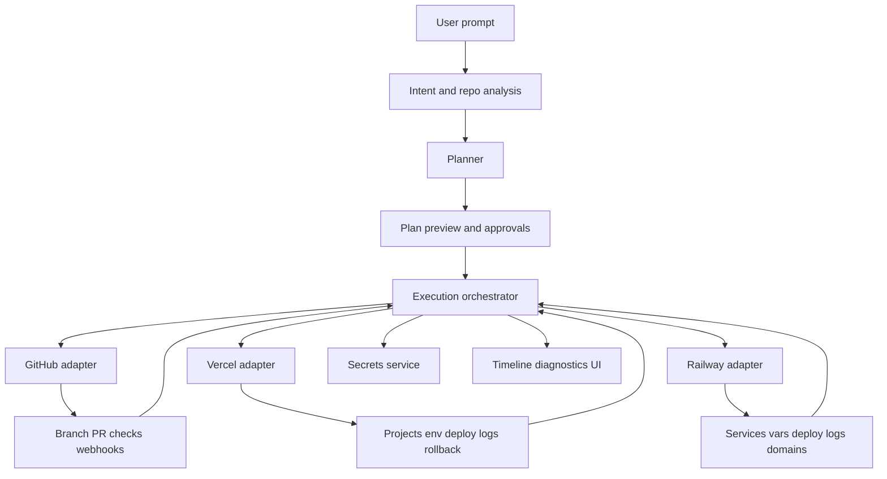
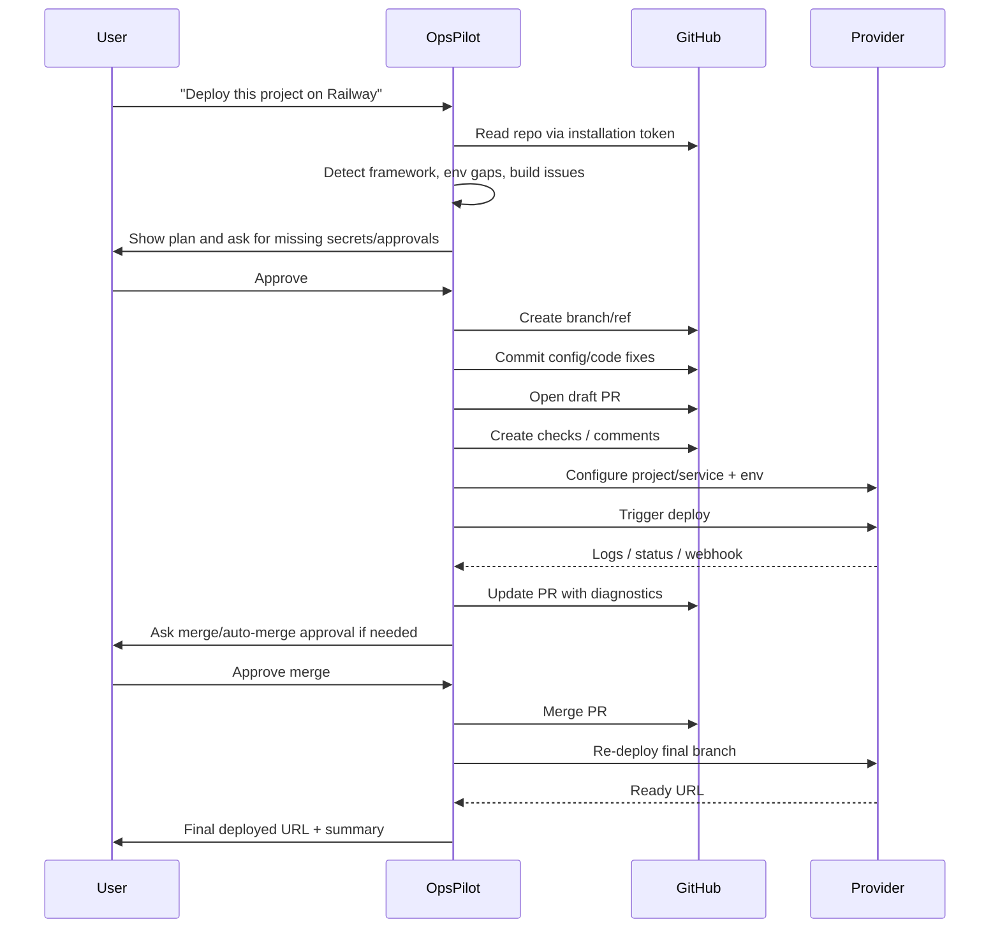

# OpsPilot integration research for Vercel, Railway and GitHub

## Executive summary

The core product vision is feasible, but only in a bounded, approval-driven form rather than a magical fully autonomous one-liner for every repository. The official Vercel REST API documents project creation, deployment creation, deployment lookup, build-event retrieval, runtime log streaming, environment variable creation/upsert, rollback, webhook delivery, signature validation, retries, team scoping, and rate-limit headers. Railway’s official Public API docs document a GraphQL API with project, service, deployment, variable, environment and domain management; service creation from a GitHub repository; explicit deploy and redeploy operations; build, runtime and HTTP logs; environment-wide logs; staged variable changes; OAuth/OIDC with selective workspace/project scopes; and documented rate limits. GitHub’s official docs document all the repository-side primitives OpsPilot needs: GitHub Apps, installation tokens, user access tokens, fine-grained permissions, branch/ref creation, file updates, pull requests, review requests, review comments, webhook events, checks, encrypted Actions secrets, and installation webhooks. citeturn31search2turn10view0turn10view1turn10view2turn10view3turn10view4turn12view3turn9view0turn28view0turn28view1turn28view2turn28view3turn6view0turn7view0turn28view5turn28view6turn22search1turn21view0turn20view3turn19view0turn20view1turn20view0turn16search7turn27search0turn25view0turn20view5

What is *not* feasible from a truly vague prompt alone is universal success without clarifications or approvals. Provider APIs can deploy, stream logs and accept configuration, but they cannot infer missing secrets, required billing choices, DNS ownership, unsafe infrastructure changes, private submodule credentials, or business rules hidden outside the repository. GitHub and provider APIs make automation possible; they do not remove the need for guardrails, policy, and a “plan then execute” workflow. That means OpsPilot can automate a large share of the path from repo to successful deployment, but it should still ask narrowly targeted clarifications when the repo lacks deployable defaults or when execution would create cost or security risk. This is an engineering inference from the documented API capabilities and limits, not a claim by any single provider. citeturn10view0turn10view1turn10view2turn10view3turn28view0turn28view1turn28view2turn28view3turn21view0turn26search4turn20view1turn25view0turn24search1turn24search3

The strongest implementation choice for GitHub is a **GitHub App as the primary integration**. GitHub’s own documentation says GitHub Apps are generally preferred over OAuth apps because they use fine-grained permissions, short-lived tokens, repository-specific installation scope, built-in webhooks, and can act either independently or on behalf of a user. OAuth apps remain useful for a small number of user-attributed actions and for the special workflow-file caveat, while personal access tokens should be treated as a fallback or break-glass mechanism rather than the default product path. citeturn22search1turn22search6turn26search3turn20view3turn26search0turn37view0turn37view1turn13search6

## Feasibility for Vercel and Railway

For Vercel, the feasibility answer is clearly **yes**. The REST API is exposed at `https://api.vercel.com`, uses bearer access tokens, supports team scoping with `teamId`, returns rate-limit headers, and documents endpoints for creating projects, creating deployments, getting deployment details, retrieving build logs via deployment events, streaming runtime logs, creating environment variables with optional upsert semantics, and rolling back production traffic to a previous deployment. Vercel also documents webhook events such as `deployment.created`, `deployment.error`, `deployment.ready`, `deployment.rollback`, project env-var events, and project events; webhook signatures are validated with `x-vercel-signature`; delivery retries continue for up to 24 hours with exponential backoff if your endpoint does not return `2XX`. citeturn31search2turn10view0turn10view1turn31search1turn31search7turn10view3turn10view2turn32search2turn11view1turn12view3turn12view0

For Railway, the feasibility answer is also **yes**, though the integration shape is different. Railway’s official docs describe a single Public API built on GraphQL, the same API used by the dashboard. The docs explicitly show Service creation **from a GitHub repository**, connecting an existing service to a GitHub repository, triggering deployments, redeploying services, listing deployments, getting the latest active deployment, and fetching build, runtime and HTTP logs. Variable management supports single-variable upsert, bulk upsert, import from `.env`, rendered variables for deployment, and staged changes before deploying. Railway also documents project-level webhooks for deployment status changes and alerts, plus OAuth/OIDC login with selective workspace/project scopes and refresh tokens through `offline_access`. citeturn9view0turn28view0turn28view1turn28view2turn28view3turn28view4turn6view0turn7view0turn28view5turn28view6

The main difference is not capability but **operational model**. Vercel is endpoint-oriented REST with explicit project/deployment/log primitives and native rollback. Railway is GraphQL, service-centric, and more flexible for multi-service application topologies, with especially useful deployment-log and staged-variable workflows. In practice, Vercel is a cleaner fit for “frontend deploy to CDN/serverless edge” and Railway is a cleaner fit for “backend service + env + domain + runtime logs”, although neither provider is limited to only one side of the stack. That last sentence is an implementation judgement based on their documented operational primitives. citeturn10view0turn10view1turn10view2turn10view3turn32search2turn28view0turn28view1turn28view2turn28view3turn28view4

### Provider capability matrix

The table below maps the documented capabilities to what OpsPilot would need for a common deployment layer. All claims are drawn from the cited official docs; where the reviewed pages did not specify a detail, it is marked as unspecified.

| Capability | Vercel | Railway |
|---|---|---|
| API style | Versioned REST API under `https://api.vercel.com`. citeturn31search2turn10view0turn10view1 | Public API is GraphQL and is the same API used by the Railway dashboard. citeturn9view0turn30view0 |
| Auth model | Bearer access tokens for REST API; integrations can exchange an OAuth code for an access token; team resources can be targeted with `teamId` or `slug`. citeturn31search2turn10view7 | Account, workspace, project tokens, or OAuth access tokens; OAuth is based on OAuth 2.0 + OIDC. citeturn9view0turn7view0turn28view6 |
| Fine-grained app permissions | Integration permissions are install-managed, and project access can be managed per integration. The reviewed docs confirm permission controls but do not provide a single endpoint-level scope matrix on the reviewed pages. citeturn10view6turn10view7 | OAuth scopes are explicit: `workspace:*`, `project:*`, `offline_access`, `openid`, `email`, `profile`, and users choose which workspaces/projects to share. citeturn28view5 |
| Create project / service | `POST /v11/projects`. citeturn10view0 | Service creation from GitHub repo, Docker image, or empty service is documented. citeturn28view0 |
| Connect source repo | Deployment payload supports `gitSource`; project creation/deployment settings expose build/runtime/root-directory configuration. citeturn34view0turn34view2turn33view4 | Create a service from a GitHub repository or connect an existing service to a repo. citeturn28view0 |
| Env var management | `POST /v10/projects/{idOrName}/env` creates env vars; `upsert=true` updates existing values instead of duplicating. citeturn10view2 | Single and bulk variable upsert; `.env` import pattern; rendered variables; staged changes before deploy. citeturn28view2turn28view3 |
| Trigger deploy | `POST /v13/deployments`. citeturn10view1 | Deploy a service, optionally with a specific `commitSha`. citeturn28view0turn29view1 |
| Read build logs | `GET /v3/deployments/{idOrUrl}/events` for build logs. citeturn31search1 | Build logs documented in deployment API cookbook. citeturn28view1 |
| Read runtime logs | `GET /v1/projects/{projectId}/deployments/{deploymentId}/runtime-logs`. citeturn10view3 | Runtime logs documented per deployment; environment-wide logs also documented. citeturn28view1turn28view3 |
| Rollback / redeploy | Explicit rollback endpoint `POST /v1/projects/{projectId}/rollback/{deploymentId}`. citeturn32search2 | Overview promises deployment management including rollback; extracted cookbook page explicitly shows redeploy existing deployment and selecting latest active deployment. citeturn30view0turn28view1 |
| Webhooks | Rich event model, signed with `x-vercel-signature`, 30s timeout, retries for up to 24h with exponential backoff. citeturn10view4turn11view1turn12view3turn12view0 | Project webhooks for deployment status changes and alerts; reviewed page shows setup and payload model, but signature-verification details were not specified on the reviewed page. citeturn6view0 |
| Rate limits | Response headers plus endpoint-specific/product-specific limits; examples include 100 builds/hour and 100 deployments/day on Hobby. citeturn31search2turn10view5 | 100/1,000/10,000 requests per hour by plan, plus 10 or 50 RPS by plan; headers include `X-RateLimit-*` and `Retry-After`. citeturn9view0turn30view1 |
| Notable limitations | Team/token scope issues can cause `403`; the full Vercel limits matrix is endpoint-specific and large. citeturn31search4turn10view5 | Reviewed docs did not surface webhook signing details on the webhook page; literal GraphQL endpoint URL was not visible in the extracted page text reviewed here. citeturn6view0turn30view0 |

### Suggested common interface

A practical provider abstraction for OpsPilot should be capability-based rather than pretending every provider is identical:

```ts
type DeployProvider = {
  provider: "vercel" | "railway" | "aws" | "render" | string;
  authMode: "oauth" | "token" | "app-installation" | "assume-role";

  connectAccount(input: ConnectAccountInput): Promise<ConnectedAccount>;
  listTargets(input: ListTargetsInput): Promise<TargetSummary[]>;
  detectCapabilities(input: DetectCapabilitiesInput): Promise<CapabilitySet>;

  ensureProject(input: EnsureProjectInput): Promise<ProjectRef>;
  connectSource(input: ConnectSourceInput): Promise<SourceLinkResult>;
  upsertEnv(input: UpsertEnvInput): Promise<EnvMutationResult>;
  validateEnv(input: ValidateEnvInput): Promise<EnvValidationResult>;

  triggerDeploy(input: TriggerDeployInput): Promise<DeployRunRef>;
  getDeployStatus(input: GetDeployStatusInput): Promise<DeployRunStatus>;
  streamBuildLogs(input: StreamLogsInput): AsyncIterable<LogEvent>;
  streamRuntimeLogs(input: StreamLogsInput): AsyncIterable<LogEvent>;
  listDomains(input: ListDomainsInput): Promise<DomainRef[]>;
  ensureDomain(input: EnsureDomainInput): Promise<DomainMutationResult>;

  rollback(input: RollbackInput): Promise<RollbackResult | Unsupported>;
  cancel(input: CancelInput): Promise<CancelResult | Unsupported>;

  registerWebhook(input: RegisterWebhookInput): Promise<WebhookRef | Unsupported>;
  verifyWebhook(input: VerifyWebhookInput): Promise<VerifiedWebhookEvent>;

  normalizeError(err: unknown): ProviderError;
};
```

The important design choice is `detectCapabilities`. Vercel can answer `rollback: true`, `build_logs: true`, `runtime_logs: true`, `signed_webhooks: true`. Railway can answer `multi_service: true`, `staged_env_changes: true`, `deployment_build_logs: true`, `deployment_runtime_logs: true`, while `signed_webhooks` should currently be `unknown` unless you verify it from a Railway page beyond what was reviewed here. That prevents the abstraction from lying. citeturn10view3turn32search2turn12view3turn28view1turn28view2turn28view3turn6view0

## Implementation patterns for provider differences

The right technical pattern is an **adapter layer plus capability detection**, not a lowest-common-denominator interface. Vercel and Railway are both “deployment providers”, but they are not shaped the same way: Vercel is REST, Railway is GraphQL; Vercel thinks in projects/deployments, Railway thinks in services/environments/deployments; Vercel gives you explicit rollback, while Railway’s reviewed cookbook clearly exposes redeploy and latest-active-deployment retrieval and the overview describes deployment rollback support. That should lead to provider-specific adapters behind a common orchestration contract. citeturn31search2turn10view0turn10view1turn28view0turn28view1turn30view0

Idempotency should be first-class. For Vercel, repeated project creation or env writes should be guarded by a cached external mapping plus “find project or create” semantics, and env upserts should prefer documented upsert behaviour. For Railway, use resource discovery first, then bulk variable upsert, and commit staged variable changes only once. Every orchestration step should carry an `opspilot_run_id`, provider target identifiers, and the repo SHA in provider metadata where possible so duplicate retries can be de-duplicated safely. citeturn10view2turn32search13turn28view2turn28view3

Retries should be provider-aware, not generic. Vercel and Railway both expose rate-limit information in headers. Railway explicitly documents `Retry-After`, `X-RateLimit-Limit`, `X-RateLimit-Remaining`, and `X-RateLimit-Reset`. Vercel documents the same family of rate-limit headers at the API level and a large endpoint-specific limits matrix. The adapter should normalise both into a common policy with exponential backoff, jitter, provider-specific cooldown interpretation, and a dead-letter state for runs that exceed a retry envelope. citeturn31search2turn10view5turn9view0turn30view1

Versioning needs to acknowledge that the providers differ. Vercel versioning is explicit in the URL path such as `/v11/projects`, `/v13/deployments`, `/v1/.../runtime-logs`; GitHub’s REST API is versioned and expects an `X-GitHub-Api-Version` header; Railway’s GraphQL guide explicitly frames GraphQL as evolving without `/v1/` style versioning, and recommends schema introspection. OpsPilot should therefore version *its own* internal adapter interface and keep a provider compatibility matrix in code, with contract tests against each provider. citeturn10view0turn10view1turn10view3turn19view0turn21view0turn9view0turn5search5

A sensible execution architecture is:



The key fallback pattern is: if provider-native deploy configuration cannot be created confidently, OpsPilot should switch to “PR-first mode”. In PR-first mode it edits config, opens a PR, optionally adds CI checks, and only performs provider deployment after approval or after the PR merges. That sharply reduces the risk of silent drift or surprise billing while still fulfilling the “debug, fix, redeploy” value proposition. This is a product recommendation based on the verified repository and deployment APIs. citeturn20view0turn27search0turn10view1turn28view1

## GitHub integration strategy

GitHub should be treated as the system of record for source, review and change attribution. The official guidance strongly favours **GitHub Apps** over OAuth apps because GitHub Apps have fine-grained permissions, user-controlled repository access, short-lived tokens, built-in centralised webhooks, and the ability to act either independently or on behalf of a user. OAuth apps still have a place, but mostly for user sign-in and a narrow set of user-attributed flows; PATs are operationally convenient but structurally worse for a SaaS because they are user-managed long-lived credentials. citeturn22search1turn22search6turn26search3turn22search12

### Recommended model

Use **three GitHub auth modes**:

| Use case | Recommended auth | Why |
|---|---|---|
| Read repo, clone code, open PRs, comment, request review, run checks, react to webhooks | GitHub App installation token. citeturn20view3turn26search4turn22search1turn20view5 | Short-lived, repo-scoped, app-attributed, centralised webhooks. |
| User-attributed action where the user’s own permission boundary must apply | GitHub App **user access token**. citeturn26search1turn26search3turn26search0 | Token is limited to the intersection of user access and app permissions. |
| Emergency/manual admin fallback | Fine-grained PAT or classic PAT only if absolutely necessary. citeturn13search6turn26search5 | Operational fallback, not the default product path. |

The product should register a GitHub App with the minimum viable permissions and events. GitHub’s docs explicitly recommend selecting the minimum permissions required, and the REST API exposes the `X-Accepted-GitHub-Permissions` response header to discover what an endpoint needs. citeturn22search13turn20view2

### Practical permission set

A good starting GitHub App permission set for OpsPilot is:

| Permission | Level | Why OpsPilot needs it |
|---|---|---|
| Metadata | Read | Basic repository discovery. GitHub Apps typically rely on metadata for repo identification. citeturn21view0turn22search6 |
| Contents | Read/Write | Clone via installation token, create branches, update files, commit fixes. citeturn26search4turn20view1turn19view0 |
| Pull requests | Read/Write | Create PRs, request reviewers, add labels/comments, merge or update PR branch. citeturn20view0turn16search7turn36search0 |
| Checks | Read/Write | Publish diagnostics and pass/fail results in the PR UI. GitHub says creating a check run requires a GitHub App. citeturn27search0turn27search1turn27search3 |
| Commit statuses | Read/Write | Optional lighter-weight status reporting. citeturn16search9 |
| Actions | Read | Observe workflow runs/logs if you rely on Actions in debugging loops. citeturn20view5turn27search8 |
| Secrets | Read/Write only if you manage Actions secrets | Needed if OpsPilot must create repository or environment secrets through the GitHub API. citeturn25view0 |
| Webhooks | App-level | Centralised event ingestion for installation, installation repository changes, push, PR and workflow events. citeturn20view5turn22search1 |

For a classic OAuth app, the closest scope set would be `repo`, optionally `workflow` if editing `.github/workflows/*`, plus `admin:repo_hook` if you need to manage repository webhooks directly, and `read:user`/`user:email` for account identity. GitHub’s docs note that `repo` is broad and that `workflow` is required to add or update workflow files. citeturn37view0turn37view1turn37view2turn37view3turn37view4

### Best-practice repository change flow

The safest repository-writing flow for OpsPilot is:



Implementation details are well supported by GitHub’s APIs. Create the working branch through Git refs, then either use the repository contents endpoint for file-level updates or the lower-level Git database APIs for multi-file atomic trees. GitHub warns that parallel create/update/delete contents calls can conflict, so serialise file writes when using the contents endpoint. Then create a draft PR, request reviewers if your policy requires humans in the loop, add review comments or checks, and merge via the PR API when policy conditions are satisfied. If the PR branch falls behind, GitHub documents an endpoint to update the PR branch from the base branch. citeturn19view0turn20view1turn16search4turn20view0turn16search7turn36search0

For code review automation, prefer **GitHub Checks + review comments + draft PRs** over silent direct pushes to default branches. Checks are better than plain statuses because they support detailed messaging and line annotations, and GitHub says creating check runs requires a GitHub App. This is a strong fit for OpsPilot because failed build triage and fix suggestions can appear directly on the PR. citeturn27search1turn27search3turn27search0

If OpsPilot needs to modify workflow files inside `.github/workflows`, there is an important caveat. GitHub’s docs say that if you are using your app with GitHub Actions and want to modify workflow files, you must authenticate **on behalf of the user** with an OAuth token that includes the `workflow` scope, and the user must have write or admin access. That means the cleanest design is **GitHub App installation token for most repo operations, plus GitHub App user access token or OAuth consent for workflow-file mutations**. citeturn21view0turn37view1turn26search1

### Webhooks and event intake

For the App, subscribe at minimum to `installation`, `installation_repositories`, `push`, `pull_request`, `check_run`, `check_suite`, and `workflow_run` if Actions are part of the debugging loop. GitHub’s docs show that installation-related webhooks are built in for GitHub Apps, and Apps receive centralised webhooks across their accessible repositories. Webhook payloads should be validated with `X-Hub-Signature-256` using a high-entropy webhook secret stored securely on your server. citeturn20view5turn22search1turn23search0turn23search1turn23search5

### Token lifecycles and rate limits

Installation access tokens expire after one hour. GitHub App user access tokens expire after eight hours by default, and refresh tokens expire after six months. Installation-token rate limits are at least 5,000 requests per hour, or 15,000 per hour for GitHub Enterprise Cloud installations. GitHub’s comparison docs also note that GitHub App limits scale better than OAuth app limits. citeturn20view3turn26search0turn26search2turn20view6turn22search1

## Secure secrets handling and UX for vague prompts

Secrets handling must be designed so that the model never becomes the place where credentials live. The official docs support three concrete principles. First, GitHub repository and environment secrets are uploaded as **encrypted values**, and GitHub’s API explicitly requires clients to fetch a public key and encrypt the secret before creating or updating it. Second, GitHub’s webhook docs explicitly say secrets should be stored securely and never hardcoded or pushed to a repository. Third, AWS’s IAM guidance for third-party access recommends least privilege and the use of `ExternalId` with cross-account AssumeRole to prevent the confused deputy problem. These sources strongly support a design where OpsPilot stores provider credentials in an encrypted secret vault, passes them only from vault to provider API over TLS, and never includes raw secret values in LLM prompts or logs. citeturn25view0turn23search0turn24search1turn24search3turn24search5

For AWS-style deployments later, prefer **AssumeRole with ExternalId** rather than asking users for long-lived AWS keys. AWS’s docs are explicit that the primary function of `ExternalId` is to prevent confused-deputy attacks, and AWS Well-Architected guidance recommends external IDs and least-privilege trust policies for third-party SaaS access. citeturn24search1turn24search3turn24search5

The UX for a vague prompt should feel conversational but internally structured:

| UX step | What OpsPilot should do |
|---|---|
| Detect | Read repo, identify framework, package manager, monorepo root, likely frontend/backend split, and provider hints from existing config. GitHub installation token can clone over HTTPS and the provider APIs can later apply deploy settings. citeturn26search4turn34view2turn28view0 |
| Clarify only when necessary | Ask only for the missing high-impact items: provider account connection, secrets, region, paid-resource approval, DNS ownership, or whether config edits should go through PR. |
| Select provider | If the prompt names Vercel or Railway, use that adapter. If it is open-ended, recommend based on repo shape and explain why. |
| Connect credentials | Use provider OAuth where available, or token install flow for MVP. Railway OAuth is selective at workspace/project level; Vercel integrations expose managed permissions; GitHub App install is repo-selective. citeturn28view5turn7view0turn10view6turn22search1 |
| Plan preview | Show project/service creation, env vars to be set, files to edit, PR branch name, deployment target, and expected cost/risk flags. |
| Approval gate | Require explicit approval before creating billable resources, modifying repo contents, editing workflow files, or changing production env vars. |
| Execute | Create branch/PR, apply fixes, provision provider project/service, set envs, deploy, stream logs, update PR/checks. |
| Diagnose | Normalise build/runtime logs into “actionable causes”, not just raw lines. Vercel and Railway both document build/runtime log APIs. citeturn31search1turn10view3turn28view1turn28view3 |
| Finalise | Return deployed URL, PR link, build summary, mutated env names only, and rollback button if supported. |

The most important design choice here is that “vague prompt” should produce a **plan preview**, not immediate mutation. That keeps the experience user-friendly while managing billing, security and repo-governance risk. This is a product recommendation, but it is directly motivated by the documented ability of these platforms to create real resources, secrets and deployments. citeturn10view0turn10view2turn32search2turn28view0turn28view2turn28view4turn25view0

## API examples and endpoint suggestions

For Vercel, real REST endpoints can be used directly from the adapter.

```http
POST /v11/projects?teamId=team_123
Authorization: Bearer <vercel_token>
Content-Type: application/json

{
  "name": "acme-store-web"
}
```

```http
POST /v13/deployments?teamId=team_123
Authorization: Bearer <vercel_token>
Content-Type: application/json

{
  "name": "acme-store-web",
  "project": "acme-store-web",
  "gitSource": {
    "type": "github",
    "repoId": "123456",
    "ref": "opspilot/fix-railway-build",
    "sha": "abc123"
  },
  "projectSettings": {
    "framework": "nextjs",
    "installCommand": "pnpm install",
    "buildCommand": "pnpm build",
    "rootDirectory": "apps/web"
  },
  "target": "production"
}
```

```http
GET /v3/deployments/dpl_123/events?teamId=team_123
Authorization: Bearer <vercel_token>
```

```http
GET /v1/projects/prj_123/deployments/dpl_123/runtime-logs?teamId=team_123
Authorization: Bearer <vercel_token>
```

```http
POST /v1/projects/prj_123/rollback/dpl_prev_456?teamId=team_123&description=Rollback%20after%20failed%20release
Authorization: Bearer <vercel_token>
```

Those operations are directly documented in Vercel’s official API reference. citeturn10view0turn10view1turn31search1turn10view3turn32search2

For Railway, use a generic GraphQL transport and generate strongly typed operations from introspection. Railway explicitly recommends schema introspection and even notes that because the dashboard uses the same API, you can inspect the dashboard’s network tab for mutation names when needed. That is the right operational pattern when the cookbook page does not expose literal operation names in the extracted text. citeturn9view0turn30view0

```http
POST /<railway-graphql-endpoint>
Authorization: Bearer <railway_oauth_or_workspace_token>
Content-Type: application/json

{
  "query": "mutation CreateServiceFromGitHub($input: CreateServiceFromGitHubInput!) { ... }",
  "variables": {
    "input": {
      "projectId": "proj_123",
      "environmentId": "env_123",
      "repo": "owner/repo",
      "branch": "main",
      "rootDirectory": "apps/api"
    }
  }
}
```

```http
POST /<railway-graphql-endpoint>
Authorization: Bearer <railway_token>
Content-Type: application/json

{
  "query": "mutation UpsertVars($input: VariableCollectionUpsertInput!) { ... }",
  "variables": {
    "input": {
      "environmentId": "env_123",
      "serviceId": "svc_123",
      "variables": {
        "DATABASE_URL": "vault://secret/ws123/db-url",
        "PORT": "3000"
      },
      "replace": false
    }
  }
}
```

```http
POST /<railway-graphql-endpoint>
Authorization: Bearer <railway_token>
Content-Type: application/json

{
  "query": "mutation Deploy($input: DeployServiceInput!) { ... }",
  "variables": {
    "input": {
      "serviceId": "svc_123",
      "environmentId": "env_123",
      "commitSha": "abc123"
    }
  }
}
```

The Railway cookbook explicitly confirms the existence of service creation from GitHub, variable upsert, deploy/redeploy, and build/runtime/HTTP log retrieval, even though the reviewed extracted page did not surface the full literal mutation names. citeturn28view0turn28view1turn28view2turn29view1

For GitHub App flows, the cleanest path is JWT → installation token → repo operations.

```http
POST /app/installations/INSTALLATION_ID/access_tokens
Authorization: Bearer <github_app_jwt>
Accept: application/vnd.github+json
X-GitHub-Api-Version: 2026-03-10
```

```http
POST /repos/OWNER/REPO/git/refs
Authorization: Bearer <installation_token>
Accept: application/vnd.github+json
X-GitHub-Api-Version: 2026-03-10

{
  "ref": "refs/heads/opspilot/fix-deploy-2026-06-24",
  "sha": "BASE_SHA"
}
```

```http
PUT /repos/OWNER/REPO/contents/apps/api/railway.json
Authorization: Bearer <installation_token>
Accept: application/vnd.github+json
X-GitHub-Api-Version: 2026-03-10

{
  "message": "chore: add Railway deploy config",
  "content": "<base64>",
  "branch": "opspilot/fix-deploy-2026-06-24"
}
```

```http
POST /repos/OWNER/REPO/pulls
Authorization: Bearer <installation_token>
Accept: application/vnd.github+json
X-GitHub-Api-Version: 2026-03-10

{
  "title": "OpsPilot: fix deployment configuration",
  "head": "opspilot/fix-deploy-2026-06-24",
  "base": "main",
  "body": "This PR adds deployment fixes detected during automated troubleshooting.",
  "draft": true
}
```

```http
PUT /repos/OWNER/REPO/pulls/42/merge
Authorization: Bearer <installation_token>
Accept: application/vnd.github+json
X-GitHub-Api-Version: 2026-03-10

{
  "merge_method": "squash",
  "sha": "EXPECTED_HEAD_SHA"
}
```

The underlying GitHub primitives are documented in the Git refs, repository contents, pull request and GitHub App docs, including installation token expiry, user-token expiry, and merge/update-branch operations. citeturn20view3turn19view0turn20view1turn20view0turn36search0turn26search0turn26search4

## Risks, mitigations and roadmap

The highest-risk technical issues are repository ambiguity, secrets discovery, provider-drift, permission shortfalls, and feedback-loop instability. Repository ambiguity appears when the repo is a monorepo, lacks build scripts, contains both frontend and backend services, or requires private submodules. Permission shortfalls appear when the GitHub App is installed on the wrong repository set, when the Vercel token lacks access to the intended team, or when Railway OAuth only has project-level but not workspace-level access. Feedback-loop instability appears when every failed deployment causes a new fix commit and redeploy, creating an infinite loop. All of these are foreseeable from the provider docs and the shape of the APIs. citeturn31search4turn28view5turn20view5turn22search1

A practical mitigation table looks like this:

| Risk | Why it matters | Mitigation |
|---|---|---|
| Ambiguous repo layout | Wrong root directory or wrong service split causes bad deploy plans. | Run repo analysis first; require plan preview when multiple deployable roots are detected. |
| Missing secrets | Provider can deploy, but app still fails. | Collect required env names before execution; never send secret values to the LLM; validate presence before deploy. citeturn10view2turn28view2turn25view0 |
| Private submodules / private package registries | Builds fail despite correct top-level repo access. | Detect submodule and package-manager auth files; ask for additional credentials or switch to PR-only mode. |
| Workflow-file edits | GitHub has a special permission model for workflows. | Use user-attributed OAuth/App user token with `workflow` scope when editing `.github/workflows`. citeturn21view0turn37view1 |
| Webhook spoofing | Fake events can trigger unwanted actions. | Validate Vercel and GitHub signatures; treat Railway signature verification as unresolved until separately confirmed. citeturn12view3turn23search0turn6view0 |
| Secondary or hard rate limits | Can stall orchestration or cause repeated failures. | Provider-aware retry/backoff and queueing; use rate-limit headers. citeturn31search2turn10view5turn9view0turn20view6turn36search0 |
| Infinite redeploy loops | Cost and noisy commits. | Cap automated fix iterations per run; require human approval after N failures or on semantic code changes. |
| Surprising billing / resource creation | Bad UX and trust loss. | Explicit approval gate before production deploy, paid add-ons, or domain purchase. |
| Branch protection / merge rules | Bot may create PR but be unable to merge. | Respect branch protection, CODEOWNERS, required checks, merge queues; surface blocked state instead of force-acting. citeturn14search16turn27search12 |
| Provider API changes | Breaks adapters over time. | Contract tests against official sandbox/test repos; capability registry; provider-specific changelog watch. |

### Prioritised roadmap

| Phase | Scope | Acceptance criteria | Estimated effort |
|---|---|---|---|
| MVP | GitHub App install, Vercel token connection, Railway OAuth/token connection, repo analysis, plan preview, Vercel deploy, Railway service deploy, log streaming, draft PR creation | User can connect GitHub + one provider, choose a repo, see a plan, deploy successfully for a golden-path app, and receive logs plus PR for config/code changes | 6–8 engineer-weeks |
| Beta | Automatic diagnosis loop, Railway multi-service support, Vercel rollback, GitHub checks, reviewer requests, env collection UI, secrets vault, cap on auto-fix iterations | Golden-path repos auto-fix common missing config/build issues; app posts checks and draft PRs; rollback works on Vercel; Railway staged vars are supported | 8–12 engineer-weeks |
| GA | User-attributed actions, workflow-file editing with proper consent, AWS AssumeRole connector, policy engine, audit log, richer domain/DNS flows, cost-aware approvals, provider health dashboards | Production-ready approvals, auditability, least-privilege credentialing, policy-driven execution, and support for more than one deployment target per repo | 12–16 engineer-weeks |

The MVP should intentionally avoid the claim “deploy anything from one vague sentence”. A credible MVP promise is: **“Connect GitHub and a provider, preview the execution plan, let OpsPilot configure/deploy, watch logs, and receive a PR for any code or config changes needed to make the deployment succeed.”** That promise aligns tightly with the APIs that are already documented today. citeturn10view0turn10view1turn10view3turn28view0turn28view1turn20view0turn27search0

## Open questions and limitations

A few details were not fully specified in the reviewed extracted pages and should be marked as such in your design docs. Railway’s reviewed webhook page documented setup, events and payload behaviour, but I did not find signature-verification details on the pages reviewed here, so that should currently be treated as **unspecified in the reviewed docs**. The Railway Public API page confirmed a single GraphQL endpoint exists, but the literal endpoint URL was not visible in the extracted text returned by the tool, so I have treated it as documented conceptually but not reproduced literally here. Vercel integration permission controls were clearly documented, but I did not extract a full endpoint-by-endpoint permission taxonomy for Vercel integrations from the reviewed pages, so that should also be treated as partially specified here. citeturn6view0turn30view0turn10view6turn10view7

The bottom-line product answer is still strong: **OpsPilot can absolutely be built to analyse a repo, connect GitHub plus Vercel or Railway, deploy, inspect logs, propose and apply fixes, open PRs, and re-deploy**. What makes it reliable is not pretending provider APIs are identical; it is building an adapter-capability layer, using GitHub App-first security, keeping secrets out of model context, and enforcing a humane approval-driven workflow around vague prompts. citeturn10view0turn10view1turn10view3turn28view0turn28view1turn22search1turn20view3turn25view0turn24search3