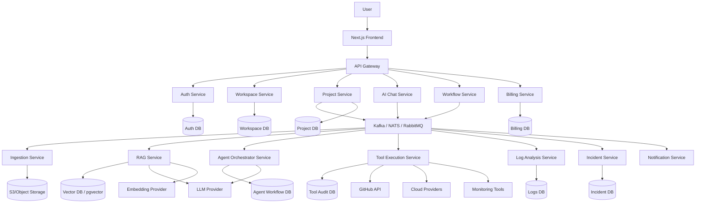
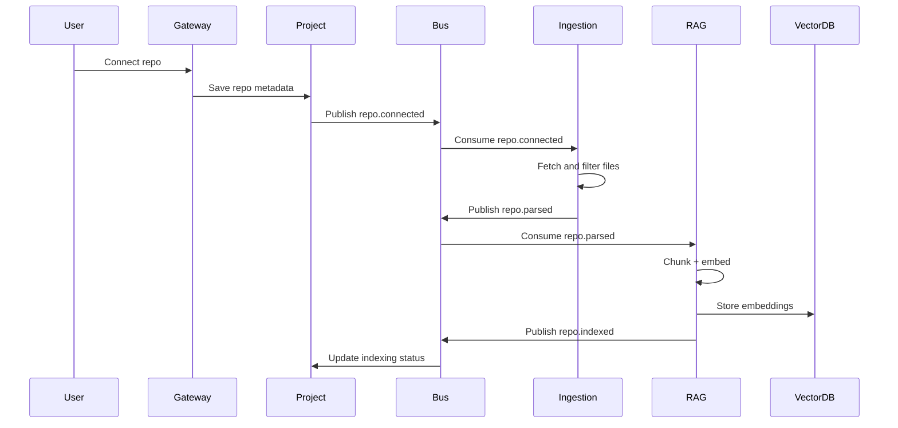
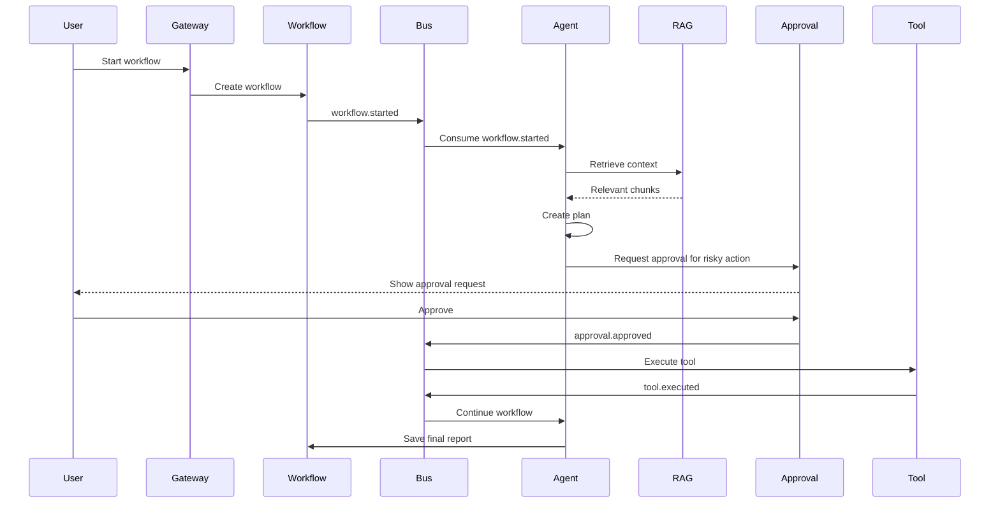
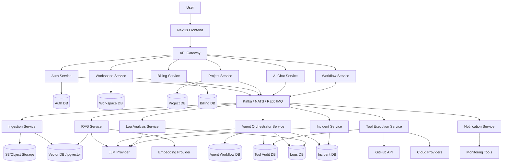
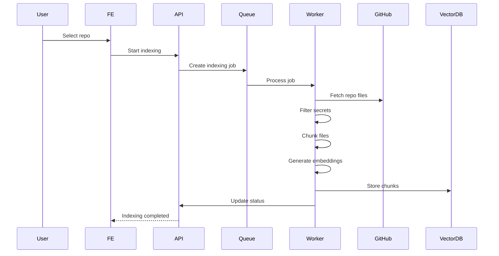
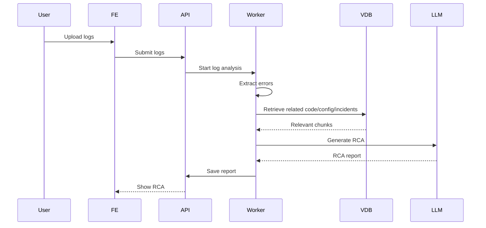
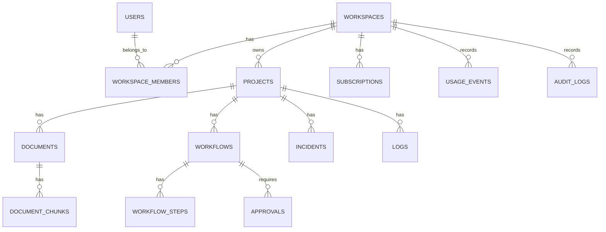
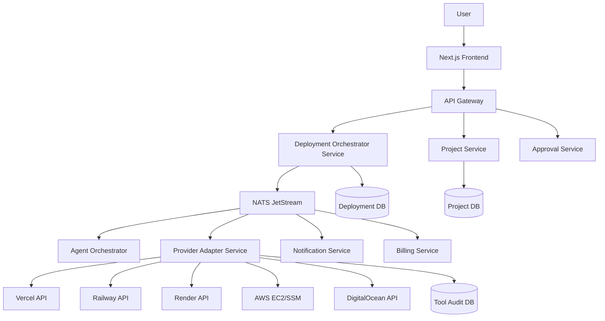

# OpsPilot — Agentic AI DevOps Assistant for Small Teams

## 1. Executive Summary

**OpsPilot** is a SaaS platform that helps small engineering teams deploy, monitor, debug, and recover applications using **Agentic AI + RAG**.

The product connects to a user’s GitHub repository, deployment environment, logs, monitoring data, and infrastructure configuration. It uses RAG to understand the project context and an AI agent to perform controlled DevOps workflows such as deployment planning, Dockerfile generation, log analysis, incident debugging, rollback recommendation, and GitHub issue/PR creation.

The MVP should focus on **safe, assisted DevOps automation**, not fully autonomous production control. The agent should recommend actions, generate configs, analyze failures, and request human approval before making risky changes.

---

# 2. Product Documentation

---

## 2.1 Product Requirements Document / PRD

### Product Name

**OpsPilot**

### One-Line Product Pitch

An Agentic AI DevOps assistant that understands your codebase, deployment setup, and logs to help deploy, monitor, debug, and recover applications faster.

### Problem Statement

Small teams and solo developers often struggle with DevOps tasks such as Dockerization, cloud deployment, production debugging, log analysis, incident response, and rollback decisions. These tasks require experience across infrastructure, application code, monitoring, CI/CD, and cloud platforms.

Existing DevOps tools are powerful but fragmented. Developers still need to manually inspect repositories, read logs, compare commits, check deployment settings, and decide recovery steps.

### Target Users

| User Type            | Description                                          |
| -------------------- | ---------------------------------------------------- |
| Indie developers     | Developers deploying personal or SaaS projects       |
| Early-stage startups | Small teams without dedicated DevOps engineers       |
| Backend developers   | Developers who need deployment and debugging support |
| Student builders     | Developers learning production deployment            |
| Small agencies       | Teams managing multiple client apps                  |

### Market Need

Small teams increasingly deploy full-stack apps on services like AWS EC2, Railway, Render, DigitalOcean, Vercel, and Kubernetes. They need faster debugging, deployment assistance, and operational visibility without hiring a dedicated DevOps engineer early.

### Goals and Objectives

| Goal                             | Description                                        |
| -------------------------------- | -------------------------------------------------- |
| Reduce deployment friction       | Help users generate correct deployment configs     |
| Improve debugging speed          | Analyze logs and explain root causes               |
| Create project-aware DevOps help | Use RAG over repo, logs, configs, and docs         |
| Enable safe automation           | Agent performs actions only with approval          |
| Preserve incident memory         | Learn from past incidents and fixes                |
| Support small teams              | Affordable SaaS for teams without DevOps engineers |

### MVP Scope

The MVP should include:

1. User authentication
2. Workspace/project creation
3. GitHub repository connection
4. Repository file ingestion
5. RAG-based codebase Q&A
6. Dockerfile and docker-compose generation
7. Manual log upload/paste
8. Log analysis and RCA generation
9. Incident history storage
10. Agent workflow for deployment diagnosis
11. Human approval before GitHub issue/PR creation
12. Basic dashboard
13. Usage-based limits
14. Basic billing-ready architecture

### Out of Scope for MVP

| Item                                   | Reason                                           |
| -------------------------------------- | ------------------------------------------------ |
| Fully autonomous production deployment | Too risky for MVP                                |
| Auto rollback without approval         | Requires mature guardrails                       |
| Kubernetes operator                    | Advanced infra complexity                        |
| Real-time server monitoring agent      | Can be added after MVP                           |
| Multi-cloud full automation            | Too broad                                        |
| Enterprise RBAC                        | Later stage                                      |
| SOC2 compliance                        | Later stage                                      |
| Deep infra provisioning                | Start with recommendations and config generation |

### Core User Problems

| Problem                         | Impact                                    |
| ------------------------------- | ----------------------------------------- |
| Does not know how to deploy app | Deployment takes days instead of hours    |
| Dockerfile errors               | App works locally but fails in production |
| Cannot understand logs quickly  | Long downtime                             |
| No incident memory              | Same issue repeats                        |
| No DevOps expert in team        | Poor production reliability               |
| Context switching between tools | Slow debugging                            |
| Fear of breaking production     | Manual, slow decision-making              |

### Proposed Solution

OpsPilot solves this by combining:

* **RAG** for project-aware understanding
* **Agentic AI** for multi-step task planning
* **Tool calling** for GitHub, logs, deployment, and monitoring actions
* **Human approval** for sensitive actions
* **Incident memory** for future debugging
* **SaaS dashboard** for project, history, and workflow management

### Key Product Modules

| Module              | Description                                 |
| ------------------- | ------------------------------------------- |
| Auth & Organization | Login, workspaces, users                    |
| Project Manager     | Connect repos and manage project settings   |
| Ingestion Pipeline  | Parse repo files, docs, configs, logs       |
| RAG Engine          | Retrieve relevant project context           |
| Agent Orchestrator  | Plans and executes DevOps workflows         |
| Tool Layer          | GitHub, logs, deployment, monitoring tools  |
| Approval System     | Requires user approval before risky actions |
| Incident Memory     | Stores past failures, RCA, fixes            |
| Dashboard           | Project health, workflows, history          |
| Billing             | Subscription and usage limits               |
| Admin Panel         | Manage users, plans, system usage           |

### User Roles

| Role      | Permissions                                  |
| --------- | -------------------------------------------- |
| Owner     | Manage billing, workspace, projects, members |
| Admin     | Manage projects, integrations, workflows     |
| Developer | Ask questions, run agent workflows           |
| Viewer    | Read-only access to reports and incidents    |

### User Journeys

#### Journey 1: First-Time User Onboarding

1. User signs up
2. Creates workspace
3. Connects GitHub
4. Selects repository
5. OpsPilot indexes repo
6. User asks: “How do I deploy this?”
7. System generates deployment plan and Dockerfile
8. User reviews and accepts

#### Journey 2: Debug Production Error

1. User uploads/pastes logs
2. Agent retrieves related code/config files
3. Agent identifies probable root cause
4. Agent explains why it failed
5. Agent suggests fix
6. User approves GitHub issue/PR creation

#### Journey 3: Deployment Readiness Check

1. User selects a project
2. Runs “Deployment Readiness Scan”
3. Agent checks Dockerfile, env vars, ports, DB config, build commands
4. System outputs pass/fail checklist
5. User fixes issues before deployment

### Assumptions

* Users will connect GitHub repositories.
* Initial logs will be manually uploaded or pasted.
* MVP will not directly access production servers unless explicitly configured.
* Users want assistance first, automation later.
* Small teams prefer safety over full autonomy.

### Constraints

| Constraint               | Impact                                      |
| ------------------------ | ------------------------------------------- |
| AI hallucination risk    | Must use RAG citations and guardrails       |
| Cloud platform diversity | MVP must support limited deployment targets |
| GitHub permissions       | Need least-privilege OAuth scopes           |
| Cost of LLM calls        | Need caching and usage limits               |
| Sensitive secrets        | Must never index `.env` values directly     |
| Tool execution risk      | Human approval required                     |

### Risks

| Risk                          | Mitigation                                   |
| ----------------------------- | -------------------------------------------- |
| Agent suggests unsafe command | Approval gate and command sandboxing         |
| Wrong root cause              | Show confidence and source citations         |
| Secret leakage                | Secret scanner before indexing               |
| High AI cost                  | Token limits, caching, smaller models        |
| Poor retrieval quality        | Chunking, metadata, reranking                |
| User distrust                 | Transparent reasoning and logs               |
| Platform lock-in              | Start with generic Docker and GitHub support |

### Success Criteria

| Metric                           | Target                 |
| -------------------------------- | ---------------------- |
| Repo indexing success rate       | 95%+                   |
| RAG answer grounded with sources | 90%+                   |
| Dockerfile generation usefulness | 80%+ user approval     |
| Log RCA usefulness               | 75%+ positive feedback |
| Agent workflow completion        | 85%+                   |
| First value time                 | Under 10 minutes       |
| MVP activation rate              | 40%+                   |
| Weekly retention                 | 25%+ for early users   |

---

## 2.2 Functional Requirements

| ID     | Feature / Module          | Description                                    | User Role       | Input                  | Output                    | Priority    | Acceptance Criteria                       |
| ------ | ------------------------- | ---------------------------------------------- | --------------- | ---------------------- | ------------------------- | ----------- | ----------------------------------------- |
| FR-001 | Authentication            | Users can sign up, log in, and manage sessions | All             | Email/OAuth            | Authenticated session     | Must have   | User can securely log in and out          |
| FR-002 | Workspace Management      | Users can create and manage workspaces         | Owner/Admin     | Workspace name         | Workspace created         | Must have   | Workspace appears on dashboard            |
| FR-003 | Project Creation          | Users can create projects inside workspace     | Owner/Admin     | Project name, repo URL | Project created           | Must have   | Project stored in DB                      |
| FR-004 | GitHub Integration        | Connect GitHub repository using OAuth          | Owner/Admin     | GitHub auth            | Repo access token         | Must have   | Repo list is fetched successfully         |
| FR-005 | Repository Ingestion      | Parse selected repo files                      | Developer/Admin | Repo files             | Parsed documents          | Must have   | Code/docs/config files are extracted      |
| FR-006 | Secret Filtering          | Detect and exclude secrets from indexing       | System          | Repo files             | Safe indexed content      | Must have   | `.env`, keys, tokens are excluded         |
| FR-007 | RAG Pipeline              | Chunk, embed, and store repo content           | System          | Parsed files           | Vector records            | Must have   | Documents searchable through vector DB    |
| FR-008 | Vector Search             | Retrieve relevant project context              | System          | Query                  | Ranked chunks             | Must have   | Relevant files returned with metadata     |
| FR-009 | Codebase Q&A              | Ask questions about repo/deployment            | Developer       | Natural language query | Grounded answer           | Must have   | Answer includes source files              |
| FR-010 | Dockerfile Generator      | Generate Dockerfile based on stack             | Developer       | Repo context           | Dockerfile draft          | Must have   | User can copy or save generated file      |
| FR-011 | Docker Compose Generator  | Generate docker-compose config                 | Developer       | Services/env info      | Compose YAML              | Should have | Config includes app, DB, ports            |
| FR-012 | Log Upload                | User can upload/paste logs                     | Developer       | Log text/file          | Stored log entry          | Must have   | Logs saved and attached to project        |
| FR-013 | Log Analyzer              | Analyze logs using RAG + LLM                   | Developer       | Logs + repo context    | RCA report                | Must have   | RCA includes error summary and fix        |
| FR-014 | Agent Workflow Runner     | Run guided workflows                           | Developer       | Task prompt            | Step-by-step execution    | Must have   | Agent creates plan before execution       |
| FR-015 | Tool Calling              | Agent can call allowed tools                   | System          | Tool request           | Tool result               | Must have   | Tool calls are logged                     |
| FR-016 | GitHub Issue Creation     | Create issue from RCA/fix plan                 | Developer/Admin | Approved issue content | GitHub issue              | Should have | Issue created after approval              |
| FR-017 | GitHub PR Draft           | Create PR with generated config/fix            | Admin           | Approved changes       | GitHub PR                 | Could have  | PR created only after approval            |
| FR-018 | Human Approval Flow       | User approves risky actions                    | Developer/Admin | Pending action         | Approved/rejected action  | Must have   | No risky action executes without approval |
| FR-019 | Notifications             | Notify users of completed workflows            | User            | Workflow status        | Email/in-app notification | Should have | User receives status update               |
| FR-020 | Logs & History            | Store previous workflows and outputs           | All             | Workflow events        | History timeline          | Must have   | Users can view past runs                  |
| FR-021 | Incident Memory           | Save incident RCA and resolution               | Developer       | RCA/fix                | Incident record           | Must have   | Incident searchable later                 |
| FR-022 | Billing                   | Support free/pro/team plans                    | Owner           | Plan selection         | Subscription record       | Should have | Usage limits enforced                     |
| FR-023 | Admin Panel               | Internal admin views users and usage           | Internal Admin  | Admin login            | System overview           | Could have  | Admin can inspect usage safely            |
| FR-024 | Usage Limits              | Limit AI calls, repos, storage by plan         | System          | User action            | Allow/deny decision       | Must have   | Limits enforced by plan                   |
| FR-025 | Deployment Readiness Scan | Check repo for deployment blockers             | Developer       | Project repo           | Readiness report          | Must have   | Report lists missing env/config/ports     |
| FR-026 | Export Reports            | Export RCA/deployment report                   | Developer       | Report ID              | Markdown/PDF              | Could have  | Export generated successfully             |

---

## 2.3 Non-Functional Requirements

| Category          | Requirement            | Measurable Target                                       |
| ----------------- | ---------------------- | ------------------------------------------------------- |
| Performance       | Dashboard load time    | Under 2 seconds for normal projects                     |
| Performance       | RAG response time      | Under 8 seconds for normal queries                      |
| Performance       | Log analysis time      | Under 20 seconds for logs under 1 MB                    |
| Scalability       | Projects per workspace | Support 50 projects initially                           |
| Scalability       | Concurrent users       | Support 500 concurrent MVP users                        |
| Security          | Authentication         | OAuth/JWT-based secure sessions                         |
| Security          | Secret protection      | 100% exclusion of `.env` files from indexing by default |
| Security          | Tool execution         | All risky actions require approval                      |
| Privacy           | Data isolation         | Workspace-level tenant isolation                        |
| Privacy           | Repo access            | Least-privilege GitHub scopes                           |
| Reliability       | Job retries            | Retry failed indexing jobs up to 3 times                |
| Availability      | SaaS uptime            | 99.5% MVP target                                        |
| Maintainability   | Code quality           | Modular service architecture                            |
| Observability     | Logs                   | Structured logs for all API and agent actions           |
| Observability     | Tracing                | Trace each agent workflow step                          |
| Latency           | API latency            | p95 under 500 ms for non-AI APIs                        |
| Cost Optimization | LLM cost               | Track cost per workspace/project                        |
| Compliance        | Auditability           | Store all tool calls and approvals                      |
| Rate Limiting     | API limits             | Per-user and per-workspace rate limits                  |
| Backup            | DB backup              | Daily automated backups                                 |
| Recovery          | RPO/RTO                | RPO: 24h, RTO: 4h for MVP                               |
| Data Retention    | Logs                   | User-configurable retention, default 30 days            |
| Safety            | AI output validation   | Validate commands/configs before showing                |

---

## 2.4 UX Documentation

### User Personas

| Persona | Role              | Goals                   | Pain Points                | Skill Level                   | Motivation            | Expected Usage          |
| ------- | ----------------- | ----------------------- | -------------------------- | ----------------------------- | --------------------- | ----------------------- |
| Rahul   | Solo SaaS Founder | Deploy app quickly      | Weak DevOps knowledge      | Intermediate                  | Ship faster           | Weekly                  |
| Ananya  | Backend Developer | Debug production errors | Logs are hard to interpret | Advanced backend, basic infra | Reduce downtime       | Daily during incidents  |
| Karan   | Startup CTO       | Manage reliability      | No DevOps hire yet         | Advanced                      | Improve team velocity | Weekly                  |
| Meera   | Student Developer | Learn deployment        | Confused by Docker/cloud   | Beginner-intermediate         | Build portfolio       | Frequent while learning |
| Vikram  | Agency Lead       | Manage client apps      | Multiple deployments       | Intermediate                  | Save operational time | Daily/weekly            |

### User Scenarios

#### Scenario 1: User Wants to Deploy a Spring Boot App

* User connects GitHub repo.
* OpsPilot detects Java + Spring Boot.
* User asks: “Generate deployment setup.”
* Agent retrieves `pom.xml`, `application.properties`, Docker-related files.
* Agent generates Dockerfile, env template, and deployment checklist.
* User reviews and saves files.

#### Scenario 2: Production App Is Down

* User pastes error logs.
* Agent extracts stack trace and error codes.
* RAG retrieves related config and code files.
* Agent identifies probable root cause.
* Agent creates RCA and recommended fix.
* User approves GitHub issue creation.

#### Scenario 3: Team Wants Incident Memory

* Developer saves RCA after issue is resolved.
* Later, same error appears.
* Agent retrieves past incident.
* System says: “This resembles incident INC-102. Previous fix was increasing DB pool size.”

### User Stories

| ID     | User Story                                                                                       | Acceptance Criteria                      |
| ------ | ------------------------------------------------------------------------------------------------ | ---------------------------------------- |
| US-001 | As a developer, I want to connect my GitHub repo, so that OpsPilot can understand my project.    | Repo can be selected and indexed         |
| US-002 | As a developer, I want to ask deployment questions, so that I can deploy faster.                 | Answer uses retrieved repo files         |
| US-003 | As a developer, I want to generate Dockerfile, so that I can containerize my app.                | Dockerfile is generated with explanation |
| US-004 | As a developer, I want to upload logs, so that the system can diagnose failures.                 | Logs are parsed and analyzed             |
| US-005 | As an admin, I want to approve agent actions, so that risky changes do not happen automatically. | Risky action waits for approval          |
| US-006 | As a team owner, I want incident history, so that repeated issues are easier to fix.             | Incidents are searchable                 |
| US-007 | As a user, I want source citations, so that I can trust AI answers.                              | Every RAG answer shows source files      |
| US-008 | As an owner, I want usage limits, so that AI cost stays controlled.                              | Limits are enforced by plan              |

---

## 2.5 Architecture Decision

OpsPilot will use a **microservice architecture** from the beginning because the system has multiple independently scalable workloads:

* User/workspace management
* GitHub integration
* Repository ingestion
* RAG indexing and retrieval
* Agent workflow execution
* Tool execution
* Log analysis
* Incident memory
* Billing
* Notifications
* Observability

The most compute-heavy parts are **AI workflows, embedding generation, repo indexing, log processing, and tool execution**, so these must be isolated from the main API layer.

---

### Updated High-Level Architecture



---

### 2. Microservices Breakdown

| Service                | Responsibility                                  | Main DB                      | Scaling Need          |
| ---------------------- | ----------------------------------------------- | ---------------------------- | --------------------- |
| API Gateway            | Routes requests, rate limiting, auth validation | No DB                        | Horizontally scalable |
| Auth Service           | User identity, sessions, OAuth                  | Auth DB                      | Moderate              |
| Workspace Service      | Workspaces, members, roles                      | Workspace DB                 | Low-medium            |
| Project Service        | Projects, repo metadata, project settings       | Project DB                   | Medium                |
| Integration Service    | GitHub/cloud/log integrations                   | Integration DB               | Medium                |
| Ingestion Service      | Fetch repo files, parse files, clean content    | Object Storage + Metadata DB | High                  |
| RAG Service            | Chunking, embeddings, vector search, retrieval  | Vector DB                    | Very high             |
| AI Chat Service        | RAG-based Q&A API                               | Chat DB                      | High                  |
| Agent Orchestrator     | Plans and coordinates workflows                 | Agent DB                     | Very high             |
| Tool Execution Service | Executes GitHub/cloud/monitoring tools          | Tool Audit DB                | High                  |
| Approval Service       | Human approval for risky actions                | Approval DB                  | Medium                |
| Log Analysis Service   | Parses logs, extracts errors, RCA context       | Logs DB                      | High                  |
| Incident Service       | Stores RCA, incident memory, previous fixes     | Incident DB                  | Medium                |
| Billing Service        | Plans, usage limits, subscriptions              | Billing DB                   | Medium                |
| Notification Service   | Email/in-app notifications                      | Notification DB              | Medium                |
| Observability Service  | Metrics, traces, audit events                   | Logs/Telemetry Store         | High                  |

---

### 3. Recommended Scalable Tech Stack

| Layer                 | Technology                                                  |
| --------------------- | ----------------------------------------------------------- |
| Frontend              | Next.js + TypeScript                                        |
| API Gateway           | Kong / NGINX / Envoy / custom Go gateway                    |
| Backend Microservices | Go                                                          |
| AI/RAG Services       | Python FastAPI                                              |
| Event Bus             | Kafka for scale, NATS for simpler MVP                       |
| Queue                 | Kafka topics or Redis Streams                               |
| Main Database         | PostgreSQL                                                  |
| Vector Database       | pgvector initially, Qdrant later if scale increases         |
| Object Storage        | AWS S3 / Cloudflare R2 / MinIO                              |
| Cache                 | Redis                                                       |
| Containerization      | Docker                                                      |
| Orchestration         | Kubernetes                                                  |
| CI/CD                 | GitHub Actions                                              |
| Observability         | OpenTelemetry + Prometheus + Grafana + Loki                 |
| Secrets               | AWS Secrets Manager / HashiCorp Vault                       |
| Auth                  | Clerk/Auth0/Supabase Auth initially, custom later if needed |

---

## 4. Service Communication Design

## Synchronous Communication

Use REST/gRPC for user-facing and immediate-response operations.

Examples:

| From        | To               | Reason                |
| ----------- | ---------------- | --------------------- |
| Frontend    | API Gateway      | Main user requests    |
| API Gateway | Auth Service     | Validate user         |
| API Gateway | Project Service  | Fetch project details |
| API Gateway | AI Chat Service  | Ask project question  |
| API Gateway | Workflow Service | Start workflow        |

## Asynchronous Communication

Use event bus for long-running/background operations.

Examples:

| Event                    | Producer          | Consumer             |
| ------------------------ | ----------------- | -------------------- |
| `repo.connected`         | Project Service   | Ingestion Service    |
| `repo.indexing.started`  | Ingestion Service | RAG Service          |
| `embedding.created`      | RAG Service       | Project Service      |
| `workflow.started`       | Workflow Service  | Agent Orchestrator   |
| `tool.approval.required` | Agent Service     | Approval Service     |
| `tool.executed`          | Tool Service      | Workflow Service     |
| `incident.created`       | Incident Service  | Notification Service |
| `usage.recorded`         | Any service       | Billing Service      |

---

### 5. Updated Service-Level Architecture

## 5.1 API Gateway

Responsibilities:

* Route requests to internal services
* Validate JWT/session token
* Apply rate limits
* Add request ID
* Handle CORS
* Enforce API versioning
* Forward user/workspace context

Do not put business logic inside the gateway.

---

## 5.2 Project Service

Responsibilities:

* Create/manage projects
* Store repo metadata
* Store project settings
* Trigger repo indexing
* Track indexing status

Owns:

```text
projects
project_settings
project_repo_metadata
```

---

## 5.3 Ingestion Service

Responsibilities:

* Fetch repository files
* Ignore unwanted files
* Detect secrets
* Parse code/docs/config files
* Store raw safe documents in object storage
* Publish events for RAG indexing

Scales independently because repo ingestion can be heavy.

---

## 5.4 RAG Service

Responsibilities:

* Chunk documents
* Generate embeddings
* Store vectors
* Perform vector search
* Perform hybrid search
* Return source-grounded context

Owns:

```text
documents
document_chunks
embeddings
retrieval_logs
```

MVP can use `pgvector`.

At scale, move to:

```text
Qdrant / Weaviate / Pinecone
```

---

## 5.5 Agent Orchestrator Service

Responsibilities:

* Understand user task
* Create execution plan
* Retrieve context from RAG service
* Decide required tools
* Coordinate tool execution
* Pause for human approval
* Resume workflow after approval
* Generate final reports

This should be stateless where possible, with workflow state stored in DB.

Owns:

```text
agent_workflows
agent_steps
agent_memory
agent_execution_state
```

---

## 5.6 Tool Execution Service

Responsibilities:

* Execute external tool calls
* GitHub issue creation
* GitHub PR creation
* Cloud API actions
* Deployment commands
* Monitoring/log fetching
* Store all tool-call audit logs

Tool execution must be isolated because it is the riskiest part of the system.

Rules:

* No risky tool executes without approval.
* All tool requests pass through policy checks.
* Every tool call is logged.
* Every tool response is stored.

---

## 5.7 Approval Service

Responsibilities:

* Create approval requests
* Notify users
* Store approval/rejection
* Resume paused workflows

Approval-required actions:

* Create PR
* Modify files
* Trigger deployment
* Restart service
* Rollback
* Run shell command
* Change cloud config

---

## 5.8 Log Analysis Service

Responsibilities:

* Accept uploaded logs
* Parse logs
* Extract error signatures
* Detect stack traces
* Link logs with repo context
* Generate RCA through Agent/RAG

Scales separately because logs can become large.

---

## 5.9 Incident Service

Responsibilities:

* Store RCA reports
* Store resolution history
* Link incident with logs, commits, and workflows
* Make past incidents searchable through RAG

---

## 5.10 Billing Service

Responsibilities:

* Plan management
* Usage limits
* AI usage tracking
* Workspace quota
* Subscription status
* Payment webhooks

Billing should consume usage events from all services.

---

# 6. Database Ownership

For scalable microservices, each service should own its own database or schema.

## MVP Option

Use one PostgreSQL cluster with separate schemas:

```text
auth_schema
workspace_schema
project_schema
rag_schema
agent_schema
tool_schema
incident_schema
billing_schema
```

## Production Option

Use separate databases per service:

```text
auth_db
workspace_db
project_db
rag_db
agent_db
tool_db
incident_db
billing_db
```

Important rule:

```text
No service should directly read or write another service's database.
```

Services communicate through APIs or events.

---

# 7. Updated Data Flow

## Repository Indexing Flow



---

## Agent Workflow Flow



---

# 8. Scalability Strategy

## Horizontal Scaling

Each service should be stateless where possible and horizontally scalable.

| Service              | Scaling Strategy                       |
| -------------------- | -------------------------------------- |
| API Gateway          | Multiple replicas behind load balancer |
| Project Service      | Scale by API traffic                   |
| Ingestion Service    | Scale by queue length                  |
| RAG Service          | Scale by embedding/retrieval load      |
| Agent Service        | Scale by active workflow count         |
| Tool Service         | Scale by external tool call volume     |
| Log Service          | Scale by log upload volume             |
| Notification Service | Scale by message queue                 |
| Billing Service      | Low replica count, strong consistency  |

---

## Queue-Based Scaling

Use queue/event lag to autoscale workers.

Example:

```text
If repo_indexing_queue lag > 100 jobs:
    scale ingestion workers from 3 to 10

If agent_workflow_queue lag > 50 jobs:
    scale agent workers from 2 to 8

If embedding_queue lag > 500 chunks:
    scale RAG workers from 3 to 15
```

---

## Database Scaling

Start:

```text
Managed PostgreSQL + pgvector
```

Then scale using:

* Read replicas
* Partitioning by `workspace_id`
* Separate vector DB
* Connection pooling with PgBouncer
* Separate OLTP and analytics DB
* Archival for old logs/workflows

---

## Vector Search Scaling

MVP:

```text
PostgreSQL + pgvector
```

Scale stage:

```text
Qdrant
```

Reason:

* Better vector indexing
* Better filtering
* Better horizontal scaling
* Lower load on main PostgreSQL

---

## AI Scaling

AI workloads should never block normal APIs.

Rules:

* All long AI tasks go to queues.
* Agent workflows run in background workers.
* Frontend polls or uses WebSocket/SSE for workflow updates.
* Cache repeated retrieval results.
* Track token cost per workspace.
* Limit concurrent workflows by plan.

---

# 9. Deployment Architecture

## MVP Scalable Deployment

```text
Frontend:
- Vercel

Backend:
- API Gateway on Kubernetes / Railway initially
- Go microservices as Docker containers
- Python AI/RAG services as Docker containers

Infrastructure:
- Managed PostgreSQL
- Managed Redis or NATS
- S3-compatible object storage
- pgvector inside Postgres
```

## Production Deployment

```text
Kubernetes Cluster:
- api-gateway
- auth-service
- workspace-service
- project-service
- ingestion-service
- rag-service
- ai-chat-service
- agent-orchestrator
- tool-execution-service
- approval-service
- log-analysis-service
- incident-service
- billing-service
- notification-service

Data Layer:
- PostgreSQL per domain
- Qdrant for vectors
- Redis for cache
- Kafka/NATS for events
- S3 for files/logs

Observability:
- Prometheus
- Grafana
- Loki
- Tempo
- OpenTelemetry
```

---

# 10. Updated Non-Functional Scalability Targets

| Category               | Target                                           |
| ---------------------- | ------------------------------------------------ |
| API p95 latency        | Under 300-500 ms for non-AI APIs                 |
| RAG answer latency     | Under 8 seconds                                  |
| Agent workflow startup | Under 3 seconds                                  |
| Repo indexing          | Under 5 minutes for medium repos                 |
| Log analysis           | Under 20 seconds for logs under 1 MB             |
| Concurrent users       | 10,000+ with horizontal scaling                  |
| Concurrent workflows   | 1,000+ background workflows                      |
| Queue processing       | Autoscale based on queue lag                     |
| Availability           | 99.9% production target                          |
| Service isolation      | Failure in AI service should not break dashboard |
| Tenant isolation       | Every DB/query filtered by workspace/project     |
| Backpressure           | Queue limits per workspace and plan              |
| Rate limiting          | Per user, workspace, and API key                 |

---

# 11. Updated Tradeoffs

| Decision                  | Benefit                  | Tradeoff                           |
| ------------------------- | ------------------------ | ---------------------------------- |
| Microservices from start  | Scalable and modular     | More DevOps complexity             |
| Event-driven architecture | Better async processing  | Harder debugging                   |
| Separate AI workers       | Prevents API blocking    | More services to deploy            |
| Database per service      | Strong ownership         | Harder cross-service queries       |
| Kubernetes                | Production-grade scaling | Learning/setup overhead            |
| Kafka/NATS                | Reliable workflow events | Extra infra dependency             |
| pgvector first            | Simple MVP               | May need vector DB migration later |
| Human approval service    | Safer automation         | More workflow complexity           |

---

# 12. Updated MVP Build Strategy

Even with microservices, do not build all services fully on day one.

## Phase 1 — Core Platform

Build:

* API Gateway
* Auth Service
* Workspace Service
* Project Service
* Frontend dashboard

## Phase 2 — RAG Foundation

Build:

* Ingestion Service
* RAG Service
* Vector DB
* Object Storage

## Phase 3 — Agent Workflows

Build:

* Workflow Service
* Agent Orchestrator Service
* AI Chat Service
* Workflow timeline UI

## Phase 4 — DevOps Tools

Build:

* Tool Execution Service
* Approval Service
* GitHub issue creation
* Dockerfile generation
* Deployment readiness scan

## Phase 5 — Incident Intelligence

Build:

* Log Analysis Service
* Incident Service
* RCA generation
* Incident memory retrieval

## Phase 6 — Scale and SaaS

Build:

* Billing Service
* Notification Service
* Observability
* Usage limits
* Kubernetes deployment
* Autoscaling

---

# 13. Final Updated Architecture Principle

OpsPilot should be designed as:

```text
Frontend + API Gateway
↓
Domain Microservices
↓
Event Bus
↓
AI/RAG/Agent Workers
↓
Tool Execution Layer
↓
Independent Databases + Object Storage + Vector DB
```

The most important rule:

```text
Keep user-facing APIs fast, and move all heavy AI, RAG, indexing, logs, and tool execution work to asynchronous microservices.
```

## 2.6 AI Agent Design

### Agents Needed

| Agent                    | Role                                      |
| ------------------------ | ----------------------------------------- |
| DevOps Planner Agent     | Breaks user request into execution steps  |
| Repo Understanding Agent | Reads repo structure and identifies stack |
| Deployment Agent         | Generates Docker/deployment configs       |
| Log Analysis Agent       | Parses logs and finds root cause          |
| Incident Agent           | Creates RCA and incident memory           |
| GitHub Agent             | Creates issues/PRs after approval         |
| Safety/Policy Agent      | Classifies action risk                    |

### Agent Tools

| Tool                         | Purpose                          |
| ---------------------------- | -------------------------------- |
| `search_repo_context`        | Retrieve code/docs/config chunks |
| `read_file`                  | Read selected repo file          |
| `analyze_logs`               | Parse uploaded logs              |
| `generate_dockerfile`        | Generate Dockerfile              |
| `generate_compose`           | Generate docker-compose          |
| `create_github_issue`        | Create issue after approval      |
| `create_github_pr`           | Create PR after approval         |
| `save_incident`              | Store RCA                        |
| `check_deployment_readiness` | Run config checklist             |
| `fetch_workflow_history`     | Retrieve previous incidents      |

### Agent Memory

| Memory Type            | Description                                 |
| ---------------------- | ------------------------------------------- |
| Short-term memory      | Current task conversation and steps         |
| Project memory         | Repo structure, stack, configs              |
| Incident memory        | Past incidents and fixes                    |
| User preference memory | Preferred cloud, language, deployment style |
| Tool memory            | Previous tool calls and results             |

### Agent Planning Loop

1. Understand user request
2. Classify task type
3. Retrieve relevant project context
4. Create step-by-step plan
5. Identify required tools
6. Classify tool risk
7. Ask for approval when needed
8. Execute safe steps
9. Observe result
10. Produce final report

### Agent Execution Loop

```text
Input task
↓
Plan
↓
Retrieve context
↓
Choose tool
↓
Check policy
↓
Execute or request approval
↓
Observe result
↓
Continue or stop
↓
Generate final answer/report
```

### Failure Handling

| Failure                  | Handling                      |
| ------------------------ | ----------------------------- |
| Tool timeout             | Retry with backoff            |
| Missing repo context     | Ask user to re-index          |
| Low retrieval confidence | Say confidence is low         |
| Invalid config generated | Run validation before showing |
| GitHub API failure       | Show error and retry option   |
| LLM failure              | Retry or fallback model       |
| Approval rejected        | Stop action and report        |

### Guardrails

* Never execute production-changing actions without approval.
* Never expose secrets.
* Never modify repository directly without diff preview.
* Always show source files for RAG answers.
* Always log tool calls.
* Always mark confidence level in RCA.
* Always distinguish facts from assumptions.

### Automatic Actions

Agent can automatically:

* Read indexed repo context
* Search vector DB
* Analyze uploaded logs
* Generate Dockerfile draft
* Generate deployment checklist
* Summarize incident
* Suggest fix
* Store non-sensitive workflow logs

### Confirmation Required

Agent must ask approval before:

* Creating GitHub issues
* Creating PRs
* Editing files
* Deploying code
* Restarting services
* Rolling back
* Accessing external cloud resources
* Running shell commands

---

## 2.7 RAG Design

### Data to Be Indexed

| Source           | Examples                                              |
| ---------------- | ----------------------------------------------------- |
| Code files       | `.java`, `.go`, `.js`, `.ts`, `.py`                   |
| Config files     | `Dockerfile`, `docker-compose.yml`, `application.yml` |
| Package files    | `package.json`, `pom.xml`, `go.mod`                   |
| Documentation    | `README.md`, docs folder                              |
| Deployment files | GitHub Actions, Railway config, Render config         |
| Logs             | Uploaded production logs                              |
| Incidents        | Previous RCA reports                                  |
| Runbooks         | User-created operational docs                         |

### Excluded From Indexing

* `.env`
* Private keys
* Credentials
* Access tokens
* Build artifacts
* `node_modules`
* `.git`
* Binary files
* Large generated files

### Chunking Strategy

| File Type     | Strategy                                |
| ------------- | --------------------------------------- |
| Markdown/docs | Heading-based chunks                    |
| Code files    | Function/class-level chunks             |
| Config files  | Full file or section-based              |
| Logs          | Error-block and timestamp-window chunks |
| JSON/YAML     | Key-section chunks                      |

Recommended chunk size:

```text
Code: 300-800 tokens
Docs: 500-1000 tokens
Logs: 500-1500 tokens
Overlap: 50-100 tokens
```

### Embedding Model

Use one embedding provider initially for simplicity.

Options:

| Option            | Use Case                      |
| ----------------- | ----------------------------- |
| OpenAI embeddings | Strong general quality        |
| Gemini embeddings | Good Google ecosystem fit     |
| Local embeddings  | Lower cost, more infra burden |

MVP recommendation:

```text
Use managed embedding API first.
Optimize later with local embedding model if cost becomes high.
```

### Vector DB Choice

MVP recommendation:

```text
PostgreSQL + pgvector
```

Reason:

* Simple architecture
* Same DB for relational + vector data
* Good enough for MVP
* Lower operational burden

Later scale options:

* Pinecone
* Weaviate
* Qdrant
* Milvus

### Metadata Strategy

Store metadata with each chunk:

```json
{
  "workspace_id": "...",
  "project_id": "...",
  "repo": "owner/repo",
  "branch": "main",
  "file_path": "src/main/resources/application.yml",
  "file_type": "config",
  "language": "yaml",
  "commit_sha": "...",
  "chunk_index": 1,
  "source_type": "repo",
  "created_at": "..."
}
```

### Retrieval Strategy

1. Convert query to embedding
2. Filter by workspace/project
3. Search top 20 chunks
4. Apply metadata filters
5. Rerank top chunks
6. Select top 5-8 chunks
7. Build grounded prompt
8. Generate answer with citations

### Reranking Strategy

MVP:

* Use hybrid scoring:

  * Vector similarity
  * Keyword match
  * File importance
  * Recency
  * Error-code match

Later:

* Add cross-encoder reranker
* Add feedback-based ranking

### Prompt Construction

Prompt should include:

* User question
* Retrieved source chunks
* Project metadata
* Task type
* Safety rules
* Required output format
* Instruction to cite source files
* Instruction to say “not enough context” when retrieval is weak

### Hallucination Prevention

* Use source-grounded answers
* Display retrieved files
* Ask clarification when context is missing
* Refuse to guess secrets or infra values
* Mark assumptions clearly
* Add confidence score
* Validate generated config syntax

### Source Citation

Each answer should cite:

```text
File: Dockerfile
File: package.json
File: src/main/resources/application.properties
Log: production-log-2026-06-18.txt
Incident: INC-102
```

### Access Control for Retrieved Documents

* Every query must include `workspace_id`
* Every vector search must filter by `project_id`
* Users can only retrieve documents from projects they can access
* Deleted documents should be removed from vector DB
* GitHub access revocation should disable future indexing

### Update/Delete Document Flow

#### Update Flow

1. User re-indexes repo
2. Fetch latest commit
3. Detect changed files
4. Delete old chunks for changed files
5. Create new chunks
6. Generate embeddings
7. Store updated chunks

#### Delete Flow

1. User removes project/repo
2. Delete documents
3. Delete vector chunks
4. Delete logs if configured
5. Remove GitHub token
6. Write audit log

---

## 2.8 Testing Documentation

### Test Plan

| Testing Type        | Objective                                                       |
| ------------------- | --------------------------------------------------------------- |
| Unit Testing        | Validate individual backend, frontend, and AI utility functions |
| Integration Testing | Verify DB, Redis, GitHub, AI worker, and backend interaction    |
| API Testing         | Ensure endpoints return correct responses and errors            |
| UI Testing          | Validate dashboard, chat, workflows, approvals                  |
| Agent Testing       | Validate planning, tool choice, approval behavior               |
| RAG Testing         | Validate retrieval quality and grounded answers                 |
| Security Testing    | Check auth, tenant isolation, secret filtering                  |
| Load Testing        | Test indexing, query, and workflow concurrency                  |
| Failure Testing     | Simulate LLM/tool/GitHub/queue failures                         |

### Test Cases

| Test ID | Feature         | Scenario              | Steps                   | Expected Result                    | Priority |
| ------- | --------------- | --------------------- | ----------------------- | ---------------------------------- | -------- |
| TC-001  | Login           | Valid login           | Enter credentials/OAuth | User reaches dashboard             | High     |
| TC-002  | Login           | Invalid session       | Use expired token       | API returns 401                    | High     |
| TC-003  | GitHub          | Connect repo          | Complete OAuth          | Repo list fetched                  | High     |
| TC-004  | File Upload     | Upload logs           | Upload `.txt` logs      | Logs stored                        | High     |
| TC-005  | Indexing        | Index repo            | Start indexing          | Chunks stored in DB                | High     |
| TC-006  | Secret Filter   | Repo has `.env`       | Run indexing            | `.env` not indexed                 | Critical |
| TC-007  | RAG Query       | Ask codebase question | Submit query            | Answer cites files                 | High     |
| TC-008  | RAG Query       | Missing context       | Ask unrelated query     | System says insufficient context   | Medium   |
| TC-009  | Agent Workflow  | Deployment scan       | Run scan                | Checklist generated                | High     |
| TC-010  | Tool Execution  | Safe tool call        | Analyze repo            | Tool executes automatically        | High     |
| TC-011  | Approval        | Risky tool call       | Create GitHub issue     | Approval requested                 | Critical |
| TC-012  | Approval        | Reject action         | Reject issue creation   | No issue created                   | Critical |
| TC-013  | Error Handling  | GitHub API fails      | Disconnect token        | Clear error shown                  | High     |
| TC-014  | Billing         | Limit reached         | Exceed AI usage         | Request blocked/upgraded           | Medium   |
| TC-015  | Security        | Cross-tenant access   | Query other project ID  | Access denied                      | Critical |
| TC-016  | Logs            | Large log file        | Upload 5 MB logs        | Chunking works or size limit shown | Medium   |
| TC-017  | Incident Memory | Save RCA              | Create incident         | Incident searchable                | High     |
| TC-018  | Load            | Concurrent queries    | 100 users query         | p95 under target                   | Medium   |

---

# 3. Process Documentation

---

## 3.1 Strategy Roadmap

| Phase            | Timeline    | Goals                | Features                                                   | Success Criteria              |
| ---------------- | ----------- | -------------------- | ---------------------------------------------------------- | ----------------------------- |
| MVP              | 0-8 weeks   | Validate core value  | GitHub ingestion, RAG Q&A, log analysis, Docker generation | 10-20 users test successfully |
| Beta Launch      | 2-4 months  | Validate paid use    | Incident memory, approvals, GitHub issues, billing         | 5 paying teams                |
| Public Launch    | 4-6 months  | Launch SaaS publicly | Better UI, onboarding, usage limits, docs                  | 100+ signups                  |
| Scale Phase      | 6-12 months | Improve reliability  | Monitoring integrations, PR generation, advanced workflows | 30%+ retention                |
| Enterprise Phase | 12+ months  | Sell to teams        | RBAC, audit logs, SSO, compliance, private deployment      | Enterprise pilots             |

---

## 3.2 Technology Roadmap

| Area          | First                    | Second                    | Later                   |
| ------------- | ------------------------ | ------------------------- | ----------------------- |
| Backend       | Go REST API              | Queue-based workflows     | Microservices if needed |
| Frontend      | Next.js dashboard        | Workflow timeline         | Team analytics          |
| AI Agent      | Basic planner + tools    | Multi-agent workflows     | Advanced policy engine  |
| RAG           | pgvector semantic search | Hybrid search + reranking | Dedicated vector DB     |
| Auth          | OAuth login              | Workspace RBAC            | SSO/SAML                |
| Billing       | Plan limits in DB        | Stripe integration        | Enterprise invoicing    |
| Observability | Structured logs          | Metrics dashboard         | Full tracing            |
| Deployment    | Docker deployment        | CI/CD pipeline            | Kubernetes/ECS          |
| Security      | Secret filtering         | Audit logs                | Compliance controls     |
| CI/CD         | GitHub Actions basic     | Test gates                | Blue-green deploy       |

---

## 3.3 Release Roadmap

| Version                 | Features                                                         | Timeline   | Dependencies       | Risks              | Testing                   |
| ----------------------- | ---------------------------------------------------------------- | ---------- | ------------------ | ------------------ | ------------------------- |
| v0.1 Internal Prototype | Repo upload, manual indexing, simple RAG Q&A                     | 2 weeks    | LLM API, DB        | Poor retrieval     | RAG tests                 |
| v0.2 MVP                | GitHub OAuth, repo indexing, log analysis, Dockerfile generation | 6-8 weeks  | GitHub API, queue  | AI cost            | API + integration tests   |
| v0.3 Beta               | Incident memory, approval flow, GitHub issue creation            | 2-4 months | Tool layer         | Unsafe actions     | Security + agent tests    |
| v1.0 Public Launch      | Billing, polished dashboard, onboarding, usage limits            | 4-6 months | Payment provider   | Low conversion     | Load + billing tests      |
| v1.5 Scale              | Monitoring integrations, PR creation, advanced reports           | 6-9 months | Cloud integrations | Tool complexity    | Failure tests             |
| v2.0 Enterprise         | RBAC, SSO, audit exports, private deployment                     | 12+ months | Compliance work    | Longer sales cycle | Compliance/security tests |

---

## 3.4 Metrics

### Product Metrics

| Metric          | Definition                                    | Target            |
| --------------- | --------------------------------------------- | ----------------- |
| Activation Rate | Users who connect repo and ask first question | 40%+              |
| Retention       | Users active after 7 days                     | 25%+              |
| DAU/MAU         | Daily active / monthly active                 | 20%+              |
| Conversion Rate | Free to paid                                  | 3-8% initially    |
| Churn           | Monthly paid user churn                       | Under 8%          |
| Time to Value   | Signup to first useful output                 | Under 10 minutes  |
| Feature Usage   | Docker/log/RAG/incident usage                 | Track per project |

### AI Metrics

| Metric                      | Definition                       | Target              |
| --------------------------- | -------------------------------- | ------------------- |
| Retrieval Accuracy          | Relevant chunks in top results   | 80%+                |
| Hallucination Rate          | Unsupported claims in answers    | Under 10%           |
| Agent Task Success Rate     | Workflows completed successfully | 85%+                |
| Tool Execution Success Rate | Tool calls completed             | 95%+                |
| Human Intervention Rate     | Actions needing approval         | Track by workflow   |
| Answer Latency              | Time to AI response              | Under 8 sec for Q&A |
| Cost per AI Request         | LLM + embedding cost             | Track and optimize  |

### Engineering Metrics

| Metric                | Target                          |
| --------------------- | ------------------------------- |
| API Latency           | p95 under 500 ms                |
| Error Rate            | Under 1%                        |
| Uptime                | 99.5% MVP                       |
| Queue Processing Time | Under 2 min for normal indexing |
| Deployment Frequency  | At least weekly                 |
| MTTR                  | Under 1 hour for MVP incidents  |
| Infra Cost            | Track per workspace/project     |

---

## 3.5 Standards

### Code Standards

* Use clear package/module boundaries.
* Keep business logic out of controllers.
* Use typed request/response models.
* Add validation for every API input.
* Write unit tests for core services.
* Use structured error responses.

### API Standards

* REST endpoints should be versioned later using `/api/v1`.
* Use consistent response format.
* Use pagination for list endpoints.
* Use idempotency keys for risky operations.
* Return clear error codes.

Example error response:

```json
{
  "error": "INDEXING_FAILED",
  "message": "Repository indexing failed because GitHub token expired.",
  "request_id": "req_123"
}
```

### Database Standards

* Use UUID primary keys.
* Add `created_at` and `updated_at`.
* Add `workspace_id` to tenant-scoped tables.
* Use migrations.
* Add indexes for common queries.
* Soft delete where needed.

### Security Standards

* Encrypt integration tokens.
* Never store raw secrets in vector DB.
* Use least-privilege OAuth scopes.
* Enforce workspace-level access control.
* Log all sensitive actions.
* Require approval for risky tools.

### Logging Standards

Each log should include:

```text
request_id
workspace_id
project_id
user_id
workflow_id
event_type
status
duration_ms
```

### Error Handling Standards

* Show user-friendly error messages.
* Store technical error internally.
* Retry transient failures.
* Do not expose stack traces to users.
* Add clear remediation steps.

### Testing Standards

* Unit tests for services
* Integration tests for DB/queue
* API tests for endpoints
* RAG golden test set
* Agent workflow simulation tests
* Security tests for tenant isolation

### Documentation Standards

Maintain:

* README
* API docs
* Architecture docs
* Deployment docs
* Agent tool docs
* RAG evaluation docs
* Incident response docs

### Git Branching Strategy

```text
main        -> production
develop     -> staging
feature/*   -> new features
fix/*       -> bug fixes
hotfix/*    -> urgent production fixes
```

### Pull Request Standards

Every PR should include:

* Summary
* Screenshots if UI
* Testing done
* Migration notes if DB changed
* Risk level
* Rollback plan

### Deployment Standards

* All deployments through CI/CD
* Run tests before deploy
* Run migrations safely
* Use environment-specific configs
* Keep rollback option
* Monitor after deployment

### AI Safety Standards

* No hidden tool execution
* Approval for risky actions
* Source citations for RAG answers
* Confidence level in RCA
* Refuse unsupported claims
* Explain assumptions

### RAG Evaluation Standards

Maintain test queries for:

* Deployment questions
* Config questions
* Log analysis
* Past incident retrieval
* Unanswerable questions
* Security-sensitive questions

---

# 4. Architecture Diagrams

## 4.1 Full System Diagram



## 4.2 Repo Indexing Sequence



## 4.3 Log Analysis Sequence



## 4.4 ER Diagram



---

# 5. Implementation Plan

## Phase 1: Foundation

1. Create monorepo or separate repos.
2. Build Next.js frontend shell.
3. Build Go backend API.
4. Set up PostgreSQL.
5. Add auth.
6. Add workspace/project schema.
7. Build project dashboard.

## Phase 2: GitHub Integration

1. Add GitHub OAuth.
2. Fetch user repos.
3. Let user select repo.
4. Store integration token encrypted.
5. Fetch repo file tree.
6. Add indexing job.

## Phase 3: RAG Pipeline

1. Parse repo files.
2. Exclude secrets and unwanted files.
3. Chunk files.
4. Generate embeddings.
5. Store chunks in pgvector.
6. Build retrieval API.
7. Build source-cited answer generation.

## Phase 4: AI Chat

1. Add project chat UI.
2. Connect query endpoint.
3. Show answer with source files.
4. Add feedback button.
5. Store chat history.

## Phase 5: DevOps Workflows

1. Add workflow runner.
2. Add deployment readiness scan.
3. Add Dockerfile generator.
4. Add docker-compose generator.
5. Add workflow timeline UI.

## Phase 6: Log Analysis

1. Add log upload/paste.
2. Parse logs.
3. Retrieve related code/config.
4. Generate RCA.
5. Store incident report.
6. Show fix suggestions.

## Phase 7: Tool Calling and Approvals

1. Define tool interface.
2. Add policy engine.
3. Add approval table.
4. Build approval modal.
5. Add GitHub issue creation.
6. Log all tool calls.

## Phase 8: Billing and Limits

1. Define free/pro/team plans.
2. Track AI requests.
3. Track indexed storage.
4. Add plan limits.
5. Add billing provider later.

## Phase 9: Production Hardening

1. Add structured logging.
2. Add metrics.
3. Add rate limiting.
4. Add queue retries.
5. Add backups.
6. Add security review.
7. Add deployment pipeline.

---

# 6. MVP Database Schema

```sql
CREATE TABLE users (
  id UUID PRIMARY KEY,
  email TEXT UNIQUE NOT NULL,
  name TEXT,
  auth_provider TEXT,
  created_at TIMESTAMP DEFAULT now(),
  updated_at TIMESTAMP DEFAULT now()
);

CREATE TABLE workspaces (
  id UUID PRIMARY KEY,
  name TEXT NOT NULL,
  owner_id UUID REFERENCES users(id),
  created_at TIMESTAMP DEFAULT now(),
  updated_at TIMESTAMP DEFAULT now()
);

CREATE TABLE workspace_members (
  id UUID PRIMARY KEY,
  workspace_id UUID REFERENCES workspaces(id),
  user_id UUID REFERENCES users(id),
  role TEXT CHECK (role IN ('owner', 'admin', 'developer', 'viewer')),
  created_at TIMESTAMP DEFAULT now()
);

CREATE TABLE projects (
  id UUID PRIMARY KEY,
  workspace_id UUID REFERENCES workspaces(id),
  name TEXT NOT NULL,
  repo_url TEXT,
  repo_provider TEXT,
  default_branch TEXT,
  status TEXT,
  created_at TIMESTAMP DEFAULT now(),
  updated_at TIMESTAMP DEFAULT now()
);

CREATE TABLE integrations (
  id UUID PRIMARY KEY,
  workspace_id UUID REFERENCES workspaces(id),
  provider TEXT NOT NULL,
  encrypted_access_token TEXT,
  metadata JSONB,
  created_at TIMESTAMP DEFAULT now(),
  updated_at TIMESTAMP DEFAULT now()
);

CREATE TABLE documents (
  id UUID PRIMARY KEY,
  workspace_id UUID REFERENCES workspaces(id),
  project_id UUID REFERENCES projects(id),
  source_type TEXT,
  file_path TEXT,
  content_hash TEXT,
  metadata JSONB,
  created_at TIMESTAMP DEFAULT now()
);

CREATE TABLE document_chunks (
  id UUID PRIMARY KEY,
  workspace_id UUID REFERENCES workspaces(id),
  project_id UUID REFERENCES projects(id),
  document_id UUID REFERENCES documents(id),
  chunk_text TEXT NOT NULL,
  embedding VECTOR(1536),
  file_path TEXT,
  file_type TEXT,
  language TEXT,
  metadata JSONB,
  created_at TIMESTAMP DEFAULT now()
);

CREATE TABLE workflows (
  id UUID PRIMARY KEY,
  workspace_id UUID REFERENCES workspaces(id),
  project_id UUID REFERENCES projects(id),
  user_id UUID REFERENCES users(id),
  workflow_type TEXT,
  status TEXT,
  input JSONB,
  output JSONB,
  created_at TIMESTAMP DEFAULT now(),
  updated_at TIMESTAMP DEFAULT now()
);

CREATE TABLE workflow_steps (
  id UUID PRIMARY KEY,
  workflow_id UUID REFERENCES workflows(id),
  step_name TEXT,
  status TEXT,
  input JSONB,
  output JSONB,
  error TEXT,
  created_at TIMESTAMP DEFAULT now()
);

CREATE TABLE approvals (
  id UUID PRIMARY KEY,
  workflow_id UUID REFERENCES workflows(id),
  requested_by UUID REFERENCES users(id),
  action_type TEXT,
  action_payload JSONB,
  status TEXT CHECK (status IN ('pending', 'approved', 'rejected')),
  decided_by UUID REFERENCES users(id),
  created_at TIMESTAMP DEFAULT now(),
  decided_at TIMESTAMP
);

CREATE TABLE incidents (
  id UUID PRIMARY KEY,
  workspace_id UUID REFERENCES workspaces(id),
  project_id UUID REFERENCES projects(id),
  title TEXT,
  severity TEXT,
  root_cause TEXT,
  resolution TEXT,
  related_logs JSONB,
  created_at TIMESTAMP DEFAULT now()
);

CREATE TABLE logs (
  id UUID PRIMARY KEY,
  workspace_id UUID REFERENCES workspaces(id),
  project_id UUID REFERENCES projects(id),
  source TEXT,
  content TEXT,
  metadata JSONB,
  created_at TIMESTAMP DEFAULT now()
);

CREATE TABLE usage_events (
  id UUID PRIMARY KEY,
  workspace_id UUID REFERENCES workspaces(id),
  event_type TEXT,
  quantity INT,
  metadata JSONB,
  created_at TIMESTAMP DEFAULT now()
);

CREATE TABLE audit_logs (
  id UUID PRIMARY KEY,
  workspace_id UUID REFERENCES workspaces(id),
  user_id UUID REFERENCES users(id),
  action TEXT,
  metadata JSONB,
  created_at TIMESTAMP DEFAULT now()
);
```

---

# 7. Agent Workflow Examples

## Example 1: Generate Deployment Setup

User prompt:

```text
Generate deployment setup for this project.
```

Agent flow:

1. Detect stack from repo files.
2. Retrieve package/build/config files.
3. Identify runtime, build command, port, env vars.
4. Generate Dockerfile.
5. Generate docker-compose.
6. Generate deployment checklist.
7. Show assumptions and source files.

Output:

* Dockerfile
* docker-compose.yml
* `.env.example`
* Deployment checklist
* Risk notes

## Example 2: Debug Production Crash

User prompt:

```text
This app is crashing. Analyze these logs.
```

Agent flow:

1. Parse logs.
2. Extract error signatures.
3. Retrieve matching code/config files.
4. Retrieve past incidents.
5. Generate probable RCA.
6. Suggest fix.
7. Ask approval to create GitHub issue.

Output:

* Error summary
* Probable root cause
* Evidence from logs/code
* Fix recommendation
* GitHub issue draft

## Example 3: Deployment Readiness Scan

User prompt:

```text
Check if this repo is ready for deployment.
```

Agent flow:

1. Check Dockerfile presence.
2. Check build command.
3. Check runtime port.
4. Check environment variable usage.
5. Check database config.
6. Check health endpoint.
7. Generate readiness score.

Output:

```text
Readiness Score: 72/100
Blockers:
- No Dockerfile found
- Missing production env example
- No health check endpoint detected
```

---

# 8. RAG Pipeline Flow

```text
GitHub Repo / Logs / Docs
↓
File Fetcher
↓
Secret Scanner
↓
Parser
↓
Chunker
↓
Embedding Generator
↓
pgvector Storage
↓
Query Embedding
↓
Vector Search + Metadata Filter
↓
Reranking
↓
Prompt Builder
↓
LLM Answer
↓
Source-Cited Response
```

---

# 9. Deployment Plan

## MVP Deployment

| Component   | Deployment                  |
| ----------- | --------------------------- |
| Frontend    | Vercel                      |
| Backend API | Railway / AWS EC2           |
| AI Worker   | Railway / AWS EC2           |
| PostgreSQL  | Managed Postgres            |
| Redis       | Managed Redis               |
| Storage     | S3-compatible               |
| Monitoring  | Basic logs + uptime monitor |

## Production Deployment Later

| Component      | Deployment                            |
| -------------- | ------------------------------------- |
| Frontend       | Vercel / Cloudflare Pages             |
| Backend        | ECS/Kubernetes                        |
| AI Worker      | Separate autoscaling worker pool      |
| PostgreSQL     | Managed Postgres with backups         |
| Redis          | Managed Redis cluster                 |
| Object Storage | S3 with lifecycle policies            |
| Observability  | Grafana/Loki/Prometheus/OpenTelemetry |

---

# 10. Future Scaling Plan

| Stage        | Scaling Action                                      |
| ------------ | --------------------------------------------------- |
| 100 users    | Optimize DB indexes, cache frequent queries         |
| 1,000 users  | Separate AI worker from API, queue all AI jobs      |
| 5,000 users  | Add worker autoscaling, improve retrieval           |
| 10,000 users | Move vector search to dedicated vector DB if needed |
| Enterprise   | Add SSO, RBAC, audit export, private deployment     |

---

# 11. Risks and Tradeoffs

| Decision                      | Benefit                           | Tradeoff                                 |
| ----------------------------- | --------------------------------- | ---------------------------------------- |
| Go backend + Python AI worker | Best of backend and AI ecosystems | More deployment complexity               |
| pgvector                      | Simple MVP architecture           | May need migration at scale              |
| Human approval                | Safer automation                  | Slower workflows                         |
| GitHub-first                  | Clear MVP scope                   | Limited for GitLab/Bitbucket users       |
| Manual logs first             | Faster MVP                        | Less automation                          |
| Managed LLM APIs              | Fast to build                     | Ongoing cost and data concerns           |
| Docker-first deployment       | Broadly useful                    | Not enough for advanced Kubernetes teams |

---

# 12. Final MVP Checklist

## Product

* [x] User signup/login
* [x] Workspace creation
* [x] Project creation
* [ ] GitHub repo connection
* [ ] Repo indexing
* [ ] RAG-based project Q&A
* [ ] Source citations
* [ ] Dockerfile generation
* [ ] Deployment readiness scan
* [ ] Log upload/paste
* [ ] Log RCA generation
* [ ] Incident memory
* [ ] Workflow history
* [ ] Human approval flow
* [ ] GitHub issue creation after approval
* [ ] Usage tracking

## Engineering

* [x] Next.js frontend
* [x] Go backend API
* [ ] Python AI worker
* [x] PostgreSQL schema
* [x] pgvector setup
* [ ] Redis queue
* [ ] Object storage
* [x] Auth middleware
* [ ] GitHub OAuth
* [ ] Secret scanner
* [ ] Embedding pipeline
* [ ] Agent workflow runner
* [ ] Tool executor
* [ ] Approval system
* [ ] Structured logs
* [ ] Rate limiting
* [ ] Basic monitoring
* [ ] CI/CD pipeline

## Safety

* [ ] No `.env` indexing
* [ ] No automatic production changes
* [ ] Tool calls logged
* [ ] Risky actions require approval
* [ ] Tenant isolation enforced
* [ ] Access tokens encrypted
* [ ] AI answers cite sources
* [ ] RCA includes confidence level
* [ ] User can delete project data

## Suggested MVP Build Order

1. Auth + workspace
2. Project creation
3. GitHub connection
4. Repo ingestion
5. pgvector RAG
6. Project Q&A
7. Dockerfile generation
8. Log analysis
9. Agent workflow runner
10. Approval system
11. Incident memory
12. GitHub issue creation
13. Billing/usage limits
14. Production hardening

---

## Final MVP Definition

The MVP is successful when a user can:

1. Sign up
2. Connect a GitHub repo
3. Index the project
4. Ask deployment/debugging questions
5. Generate Docker/deployment setup
6. Upload logs
7. Get a grounded RCA with source citations
8. Save the incident
9. Approve GitHub issue creation

This version is enough to validate whether small teams want a project-aware Agentic DevOps assistant before building full autonomous deployment and rollback.

---

# Addendum: Platform-Agnostic Deployment Automation

## 1. Product Documentation Update

### 1.1 PRD Update

#### New Core Feature

**Platform-Agnostic Deployment Assistant**

OpsPilot should allow users to deploy applications to multiple platforms using one simple workflow.

Supported deployment targets:

* Vercel
* Railway
* Render
* AWS EC2
* DigitalOcean
* Fly.io
* Future: Azure, GCP, Kubernetes, ECS

The user should not need to understand the internal deployment complexity of every platform. OpsPilot will provide a common deployment experience and internally use platform-specific adapters.

---

### Updated Problem Statement

Small teams often do not know which deployment platform is suitable for their project or how to configure different platforms correctly. Each provider has different rules for build commands, environment variables, logs, deployment APIs, runtime settings, domains, and rollback.

OpsPilot should abstract this complexity and provide a single user-friendly deployment workflow.

---

### Updated Proposed Solution

OpsPilot will introduce a **Deployment Orchestrator** that:

1. Detects the project stack from GitHub
2. Detects frontend/backend services
3. Suggests suitable deployment platforms
4. Collects required permissions and environment variables
5. Generates a deployment plan
6. Asks for user approval
7. Executes deployment using provider-specific adapters
8. Monitors deployment status
9. Shows logs, errors, and rollback options

---

### Updated MVP Scope

Add these items to MVP scope:

| Feature                          | Description                                              |
| -------------------------------- | -------------------------------------------------------- |
| Deployment target selection      | User can select Vercel, Railway, Render, or AWS EC2      |
| Platform recommendation          | OpsPilot recommends suitable platforms based on app type |
| Provider connection flow         | User connects deployment provider account/API key        |
| Environment variable collection  | OpsPilot detects and asks for required env variables     |
| Deployment plan generation       | User sees what will happen before execution              |
| Human approval before deployment | No deployment happens without approval                   |
| Basic deployment execution       | Execute deployment on selected supported provider        |
| Deployment status tracking       | Show build/deploy progress                               |
| Deployment logs                  | Fetch logs from provider when available                  |
| Deployment history               | Store previous deployment attempts                       |

---

### Updated Out of Scope for MVP

| Item                                | Reason                           |
| ----------------------------------- | -------------------------------- |
| Full Kubernetes deployment          | Too complex for first version    |
| Multi-region deployment             | Advanced scaling feature         |
| Auto-scaling infrastructure         | Later enterprise feature         |
| Full domain + SSL automation        | Add after basic deployment works |
| Automatic rollback without approval | Risky for MVP                    |
| Full AWS VPC/load balancer setup    | Too complex initially            |
| Azure/GCP support                   | Later platform adapters          |

---

## 1.2 Functional Requirements Update

| ID     | Feature / Module              | Description                                            | User Role       | Input                           | Output                   | Priority    | Acceptance Criteria                                 |
| ------ | ----------------------------- | ------------------------------------------------------ | --------------- | ------------------------------- | ------------------------ | ----------- | --------------------------------------------------- |
| FR-027 | Deployment Provider Selection | User can choose where to deploy frontend/backend       | Developer/Admin | Selected provider               | Provider selected        | Must have   | User can select Vercel, Railway, Render, or AWS EC2 |
| FR-028 | Platform Recommendation       | System recommends deployment platforms based on repo   | Developer       | Repo analysis                   | Suggested providers      | Must have   | System suggests frontend/backend deployment target  |
| FR-029 | Provider Adapter System       | Backend supports platform-specific deployment adapters | System          | Deployment provider             | Adapter execution        | Must have   | Each provider follows common interface              |
| FR-030 | Vercel Adapter                | Deploy frontend apps to Vercel                         | Developer/Admin | Vercel token/OAuth, repo config | Vercel deployment        | Must have   | Next.js app can be deployed to Vercel               |
| FR-031 | Railway Adapter               | Deploy backend/fullstack apps to Railway               | Developer/Admin | Railway token, env vars         | Railway deployment       | Should have | Backend service deploys successfully                |
| FR-032 | Render Adapter                | Deploy backend/static apps to Render                   | Developer/Admin | Render API key, env vars        | Render deployment        | Should have | Render service is created and deployed              |
| FR-033 | AWS EC2 Adapter               | Deploy backend to EC2 using Docker                     | Admin           | AWS role/SSH/SSM details        | EC2 backend deployment   | Should have | Backend container runs on EC2                       |
| FR-034 | Deployment Plan Generator     | Generate readable plan before deployment               | Developer/Admin | Repo + provider + env           | Deployment plan          | Must have   | User can review resources/actions before deploy     |
| FR-035 | Deployment Approval           | Require approval before provider actions               | Admin           | Deployment plan                 | Approved/rejected action | Must have   | No deploy action runs without approval              |
| FR-036 | Environment Variable Manager  | Detect and collect required env variables              | Developer/Admin | Env names and values            | Encrypted env storage    | Must have   | Secrets are encrypted and never sent to LLM         |
| FR-037 | Deployment Execution          | Execute approved deployment workflow                   | System          | Approved plan                   | Deployment result        | Must have   | Deployment status is tracked                        |
| FR-038 | Deployment Logs               | Fetch logs from supported providers                    | Developer/Admin | Deployment ID                   | Logs/output              | Should have | Logs are visible after deployment                   |
| FR-039 | Deployment History            | Store deployment attempts and results                  | Developer/Admin | Deployment event                | History record           | Must have   | User can view past deployments                      |
| FR-040 | Rollback Recommendation       | Suggest rollback when deployment fails                 | Developer/Admin | Failed deployment               | Rollback plan            | Could have  | Rollback requires approval                          |

---

## 1.3 Architecture Update

### New Service: Deployment Orchestrator Service

The **Deployment Orchestrator Service** is responsible for managing deployment workflows across different platforms.

Responsibilities:

* Analyze project structure
* Detect frontend/backend services
* Recommend deployment targets
* Generate deployment plan
* Validate provider credentials
* Collect missing environment variables
* Trigger provider adapter
* Track deployment status
* Fetch logs
* Store deployment history
* Coordinate rollback recommendations

---

### New Service: Provider Adapter Service

The **Provider Adapter Service** exposes a common interface for different platforms.

Each platform has its own adapter:

```text
VercelProvider
RailwayProvider
RenderProvider
AwsEc2Provider
DigitalOceanProvider
FlyIoProvider
```

All adapters implement the same deployment contract.

Example interface:

```go
type DeploymentProvider interface {
    ValidateCredentials(ctx context.Context) error
    CheckCompatibility(project ProjectAnalysis) CompatibilityResult
    GeneratePlan(project ProjectAnalysis, config DeploymentConfig) DeploymentPlan
    Deploy(plan DeploymentPlan) DeploymentResult
    GetDeploymentStatus(deploymentID string) DeploymentStatus
    GetLogs(deploymentID string) DeploymentLogs
    Rollback(deploymentID string) RollbackResult
}
```

---

### Updated Microservice Architecture



---

## 1.4 Deployment Workflow

### User-Friendly Deployment Flow

```text
1. User connects GitHub repo
2. OpsPilot analyzes repo structure
3. OpsPilot detects frontend/backend
4. User selects deployment target
5. OpsPilot asks for provider connection
6. OpsPilot detects missing environment variables
7. User adds env values
8. OpsPilot generates deployment plan
9. User approves deployment
10. OpsPilot deploys using provider adapter
11. OpsPilot shows deployment status and logs
12. OpsPilot saves deployment report
```

---

### Example Prompt

```text
Deploy my frontend on Vercel and backend on Railway.
```

OpsPilot should respond with:

```text
Detected:
- Frontend: Next.js in /frontend
- Backend: Go API in /backend
- Required env variables: DATABASE_URL, JWT_SECRET, GROQ_API_KEY

Recommended plan:
- Deploy frontend to Vercel
- Deploy backend to Railway
- Set environment variables on both platforms
- Run health check after deployment

Approval required before deployment.
```

---

## 1.5 Provider Capability Matrix

| Provider     | Frontend  | Backend   | Docker  | Env Vars | Logs           | Rollback | Difficulty  |
| ------------ | --------- | --------- | ------- | -------- | -------------- | -------- | ----------- |
| Vercel       | Excellent | Limited   | Limited | Yes      | Yes            | Yes      | Easy        |
| Railway      | Good      | Excellent | Yes     | Yes      | Yes            | Yes      | Easy        |
| Render       | Good      | Excellent | Yes     | Yes      | Yes            | Yes      | Easy-Medium |
| AWS EC2      | Manual    | Excellent | Yes     | Yes      | CloudWatch/SSH | Custom   | Hard        |
| DigitalOcean | Good      | Good      | Yes     | Yes      | Yes            | Medium   | Medium      |
| Fly.io       | Good      | Excellent | Yes     | Yes      | Yes            | Yes      | Medium      |

---

## 1.6 API Endpoint Additions

| Method | Endpoint                                      | Description                               |
| ------ | --------------------------------------------- | ----------------------------------------- |
| GET    | `/api/deployment/providers`                   | List supported deployment providers       |
| POST   | `/api/deployment/analyze`                     | Analyze repo for deployment compatibility |
| POST   | `/api/deployment/recommend`                   | Recommend deployment targets              |
| POST   | `/api/deployment/providers/:provider/connect` | Connect provider credentials              |
| POST   | `/api/deployment/plan`                        | Generate deployment plan                  |
| POST   | `/api/deployment/:id/approve`                 | Approve deployment                        |
| POST   | `/api/deployment/:id/execute`                 | Execute approved deployment               |
| GET    | `/api/deployment/:id/status`                  | Get deployment status                     |
| GET    | `/api/deployment/:id/logs`                    | Get deployment logs                       |
| GET    | `/api/projects/:id/deployments`               | List project deployment history           |
| POST   | `/api/deployment/:id/rollback-plan`           | Generate rollback plan                    |

---

## 1.7 Database Schema Additions

```sql
CREATE TABLE deployment_providers (
  id UUID PRIMARY KEY,
  workspace_id UUID NOT NULL,
  provider_name TEXT NOT NULL,
  auth_type TEXT NOT NULL,
  encrypted_credentials TEXT,
  metadata JSONB,
  status TEXT,
  created_at TIMESTAMP DEFAULT now(),
  updated_at TIMESTAMP DEFAULT now()
);

CREATE TABLE deployment_targets (
  id UUID PRIMARY KEY,
  project_id UUID NOT NULL,
  provider_name TEXT NOT NULL,
  service_type TEXT CHECK (service_type IN ('frontend', 'backend', 'database', 'worker')),
  root_directory TEXT,
  build_command TEXT,
  start_command TEXT,
  output_directory TEXT,
  runtime TEXT,
  metadata JSONB,
  created_at TIMESTAMP DEFAULT now(),
  updated_at TIMESTAMP DEFAULT now()
);

CREATE TABLE deployment_plans (
  id UUID PRIMARY KEY,
  workspace_id UUID NOT NULL,
  project_id UUID NOT NULL,
  created_by UUID NOT NULL,
  plan_status TEXT CHECK (plan_status IN ('draft', 'pending_approval', 'approved', 'rejected', 'executed')),
  provider_name TEXT NOT NULL,
  plan_summary TEXT,
  actions JSONB,
  required_env_vars JSONB,
  estimated_cost JSONB,
  risk_level TEXT,
  created_at TIMESTAMP DEFAULT now(),
  updated_at TIMESTAMP DEFAULT now()
);

CREATE TABLE deployments (
  id UUID PRIMARY KEY,
  workspace_id UUID NOT NULL,
  project_id UUID NOT NULL,
  deployment_plan_id UUID,
  provider_name TEXT NOT NULL,
  provider_deployment_id TEXT,
  status TEXT,
  frontend_url TEXT,
  backend_url TEXT,
  logs_url TEXT,
  error_message TEXT,
  metadata JSONB,
  started_at TIMESTAMP,
  completed_at TIMESTAMP,
  created_at TIMESTAMP DEFAULT now()
);

CREATE TABLE deployment_events (
  id UUID PRIMARY KEY,
  deployment_id UUID NOT NULL,
  event_type TEXT NOT NULL,
  status TEXT,
  message TEXT,
  metadata JSONB,
  created_at TIMESTAMP DEFAULT now()
);
```

---

## 1.8 AI Agent Design Update

### New Agent: Deployment Agent

Role:

* Understand deployment request
* Detect project structure
* Select suitable platform adapter
* Generate deployment plan
* Ask for missing env variables
* Request approval
* Trigger deployment
* Monitor status
* Explain failures
* Suggest rollback if needed

Tools:

| Tool                            | Purpose                               |
| ------------------------------- | ------------------------------------- |
| `analyze_project_structure`     | Detect frontend/backend/framework     |
| `recommend_deployment_provider` | Suggest Vercel/Railway/Render/AWS     |
| `generate_deployment_plan`      | Create human-readable deployment plan |
| `validate_provider_credentials` | Check if provider is connected        |
| `detect_env_variables`          | Find required env variables           |
| `execute_deployment`            | Trigger provider adapter              |
| `fetch_deployment_logs`         | Get build/runtime logs                |
| `generate_rollback_plan`        | Suggest rollback steps                |

Approval required before:

* Creating provider projects
* Adding environment variables to provider
* Creating EC2 instance
* Running SSH/SSM commands
* Deploying application
* Rolling back deployment
* Modifying repository files

---

## 1.9 Updated Process Roadmap

### MVP Update

Add:

* Vercel frontend deployment
* Railway backend deployment
* Render backend deployment
* Deployment plan generator
* Provider connection flow
* Environment variable manager
* Manual approval before deployment

### Beta Update

Add:

* AWS EC2 deployment
* Deployment logs
* Health checks
* Failed deployment RCA
* Rollback plan generation

### Public Launch Update

Add:

* DigitalOcean/Fly.io support
* Custom domain setup
* SSL automation
* Deployment templates
* Team deployment permissions

### Scale Phase Update

Add:

* Kubernetes adapter
* AWS ECS adapter
* Advanced rollback
* Auto-remediation suggestions
* Deployment cost estimation

---

## 1.10 Updated MVP Checklist

Add these items:

* [ ] Deployment Orchestrator Service
* [ ] Provider Adapter interface
* [ ] Vercel provider adapter
* [ ] Railway provider adapter
* [ ] Render provider adapter
* [ ] AWS EC2 provider adapter as advanced mode
* [ ] Deployment compatibility analyzer
* [ ] Platform recommendation engine
* [ ] Deployment plan generator
* [ ] Provider credential connection flow
* [ ] Environment variable manager
* [ ] Deployment approval screen
* [ ] Deployment execution workflow
* [ ] Deployment status tracker
* [ ] Deployment logs viewer
* [ ] Deployment history page
* [ ] Deployment failure RCA
* [ ] Rollback recommendation flow

---

## Final Updated Product Positioning

OpsPilot is not only a DevOps debugging assistant.

Updated positioning:

```text
OpsPilot is a platform-agnostic AI DevOps assistant that helps small teams understand, deploy, monitor, debug, and recover applications across platforms like Vercel, Railway, Render, AWS, and more.
```

Updated one-line pitch:

```text
Connect your repo, choose where to deploy, and let OpsPilot generate, execute, monitor, and debug your deployment with human approval at every risky step.
```

---

## 1.11 Architectural Decisions from Initial Setup

Based on hardware constraints (MacBook Air M5, 16GB RAM) and the requirement for a free, fast, and scalable MVP, the following architectural decisions were made during the initial setup phase:

1.  **AI Inference**: Local models (like Ollama) were rejected due to hardware limitations. **Groq API** running `llama3-70b` was selected for extremely fast inference and a generous free tier.
2.  **Embeddings**: **Gemini API** was selected for generating 768-dimensional vector embeddings (free, accurate, and scalable for future RAG needs).
3.  **Authentication**: **Clerk** was chosen for identity management over custom solutions due to its generous free tier (10k MAU), plug-and-play Next.js SDK, and excellent developer experience.
4.  **Message Broker**: **NATS** was selected over Kafka or RabbitMQ because it is simpler to manage, significantly lighter on resources, and perfect for the MVP phase.
5.  **Microservices Architecture**: The core API and business logic (Auth, Workspace, Project, Gateway) are built in **Go** using gRPC for inter-service communication and HTTP for the frontend Gateway. The AI Worker is isolated as a **Python FastAPI** service to leverage the extensive Python AI ecosystem.
6.  **Database**: **PostgreSQL** with the `pgvector` extension was selected to handle both structured relational data and high-dimensional AI vector embeddings natively.
